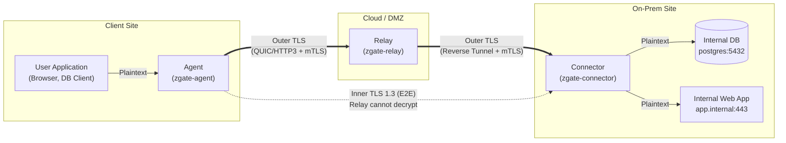
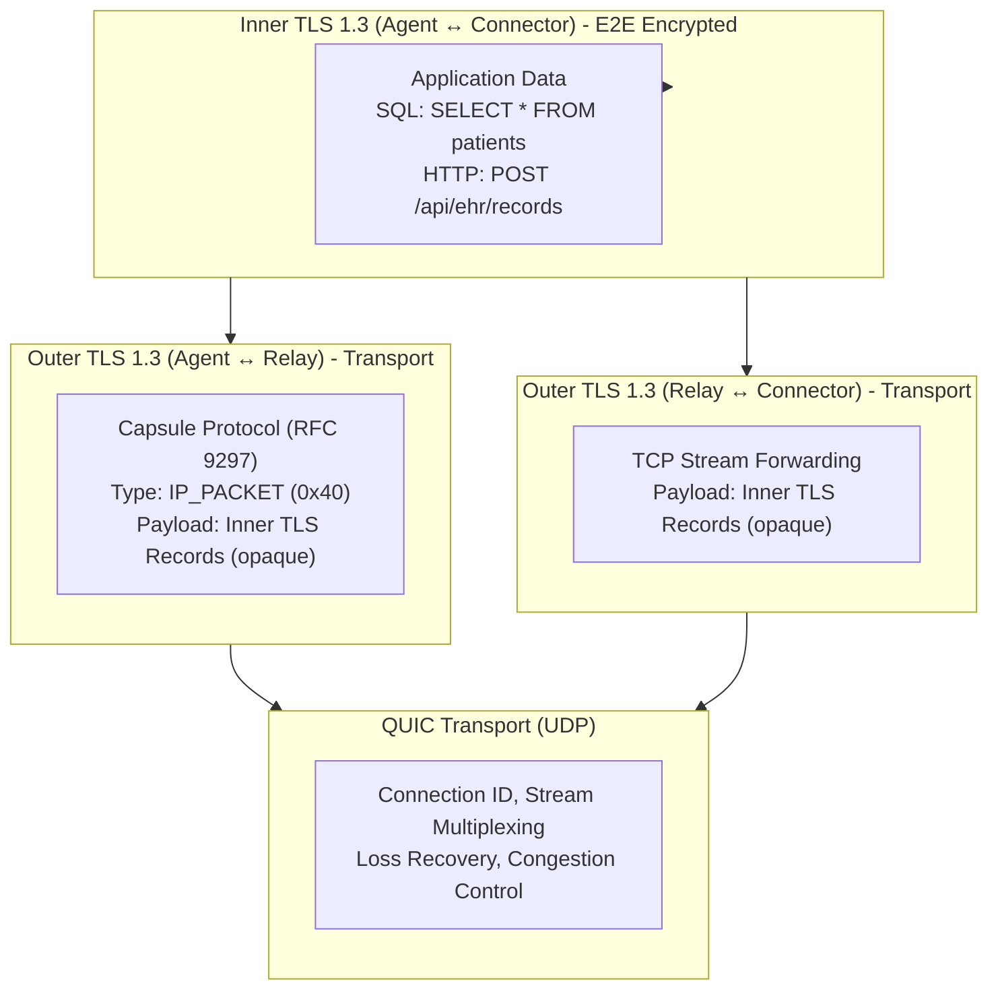
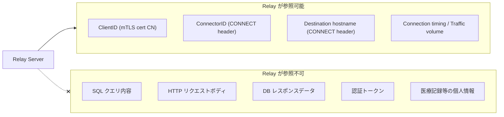
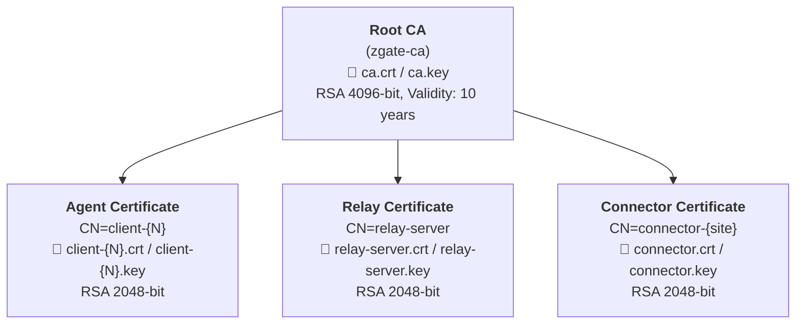
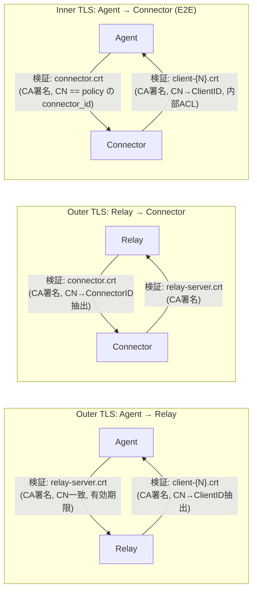
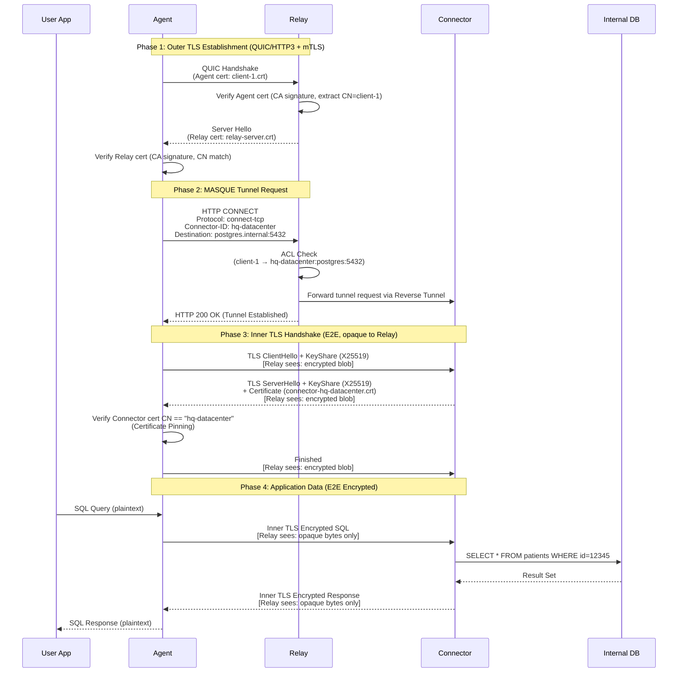
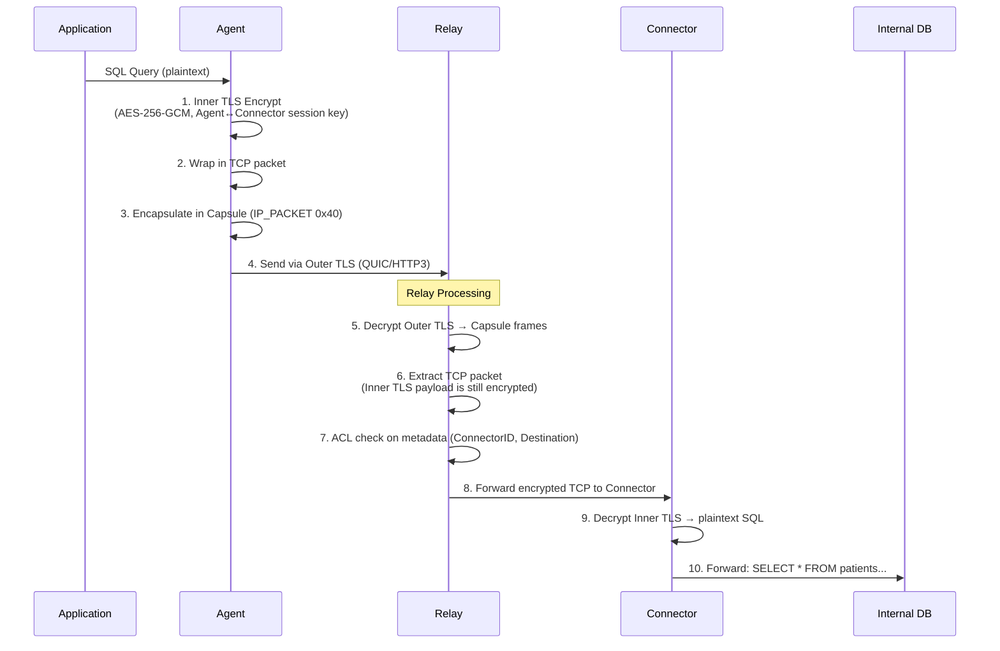
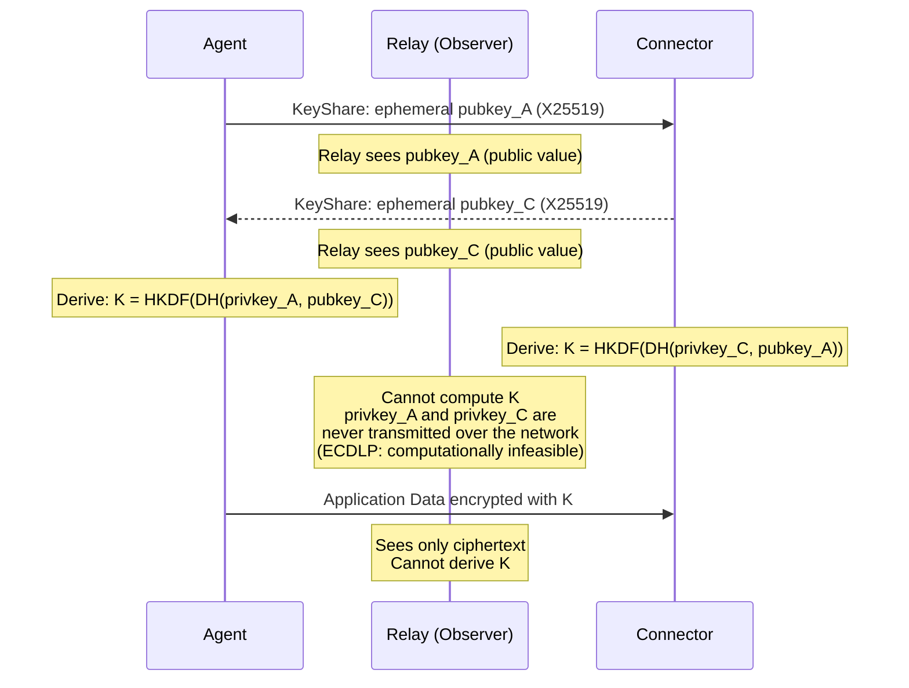
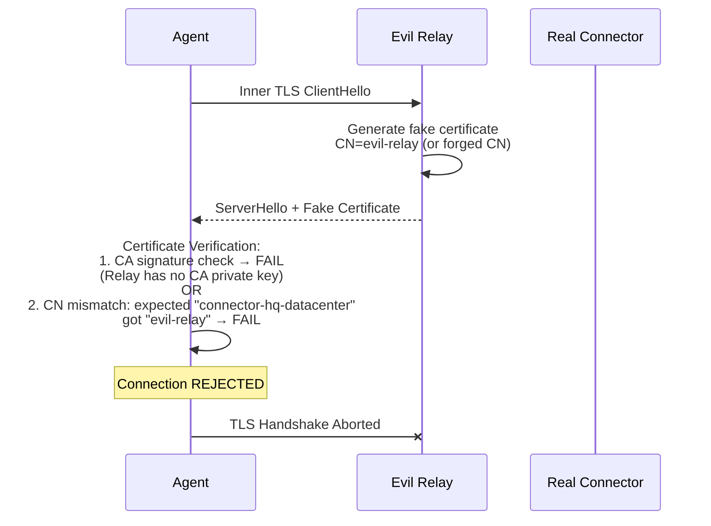

# End-to-End Encryption Design for zgate Connector

## 1. Executive Summary

zgate Connector における **Agent (Client) と Connector 間の E2E (End-to-End) 暗号化アーキテクチャ** を定義する。
Relay サーバーはトラフィックを中継するが、**通信内容を復号することは技術的に不可能** である。

**Security Goal:**
- **Relay が参照可能**: メタデータ (ClientID, ConnectorID, 宛先ホスト名)
- **Relay が参照不可**: アプリケーションデータ (SQL クエリ, HTTP リクエスト, DB レスポンス)

**法的要件 (日本):**
日本国憲法第21条2項および電気通信事業法第4条により、通信の秘密は保護される。Relay 事業者が通信内容にアクセス可能な場合、**刑事責任** (第179条: 2年以下の懲役または100万円以下の罰金) を問われる。E2E 暗号化により、Relay が技術的に復号不能であることを保証する。(法的背景の詳細は [Appendix A](#appendix-a-法的背景詳細) を参照)

**Implementation Status:** Planning (Phase 5.1)

---

## 2. System Architecture

### 2.1 Overall System Configuration



### 2.2 Nested TLS Architecture

Agent と Connector は Relay を経由する **Inner TLS** で E2E 暗号化する。Relay は Outer TLS を終端するが、Inner TLS のペイロードは暗号化されたバイト列としてしか認識できない。



### 2.3 Protocol Layers

| Layer | Protocol | Encryption | Endpoints | Purpose |
|-------|----------|------------|-----------|---------|
| **Application** | HTTP/SQL/etc | None (over Inner TLS) | App ↔ Internal Resource | Business logic |
| **Inner TLS** | **TLS 1.3** | **Agent ↔ Connector** | Agent ↔ Connector | **E2E Encryption** |
| **Capsule/Tunnel** | RFC 9297 / TCP Stream | Part of Outer TLS | Agent ↔ Relay / Relay ↔ Connector | Packet encapsulation |
| **Outer TLS** | TLS 1.3 + mTLS | Hop-by-hop | Agent ↔ Relay, Relay ↔ Connector | Authentication & transport |
| **Transport** | QUIC (UDP) | QUIC encryption | Per-hop | Loss recovery, congestion |

### 2.4 Relay Visibility

Relay が認識できる情報と認識できない情報を明確にする。



---

## 3. Threat Model

### 3.1 Attack Scenarios

| Threat | Without E2E | With E2E |
|--------|------------|----------|
| **Relay Compromise** | 全平文データが漏洩 | メタデータのみ漏洩 |
| **Malicious Relay Operator** | SQL/PII のログ取得が可能 | アプリケーションデータの復号不可 |
| **Man-in-the-Middle (Relay)** | パケット改竄が可能 | 暗号化ペイロードの改竄不可 |
| **Compliance Violation** | 医療データが第三者に露出 | E2E 暗号化済み |
| **電気通信事業法 Art.4 違反** | 事業者に刑事責任 | 技術的に復号不能で法令遵守 |

### 3.2 Trust Assumptions

**Trusted Components:**
- Agent (クライアントデバイス)
- Connector (オンプレミスゲートウェイ)
- Certificate Authority (CA)

**Untrusted Components:**
- **Relay Server** (公開/非信頼の中継ノード)
- Agent ↔ Relay ↔ Connector 間のネットワーク

---

## 4. Certificate Infrastructure

### 4.1 Certificate Hierarchy



### 4.2 Component Certificate Matrix

各システムコンポーネントが保持する証明書ファイルと用途の一覧:

#### Agent (zgate-agent)

| File | Description | Used In | TLS Role |
|------|-------------|---------|----------|
| `ca.crt` | Root CA 証明書 | Outer TLS, Inner TLS | Relay/Connector 証明書の検証 |
| `client-{N}.crt` | Agent クライアント証明書 (CN=client-{N}) | Outer TLS (Agent → Relay) | mTLS Client Authentication |
| `client-{N}.key` | Agent 秘密鍵 | Outer TLS (Agent → Relay) | mTLS Client Authentication |

**TLS 接続での役割:**
- **Outer TLS (Agent → Relay)**: TLS Client (mTLS でクライアント証明書を提示)
- **Inner TLS (Agent → Connector)**: TLS Client (Connector のサーバー証明書を検証)

#### Relay (zgate-relay)

| File | Description | Used In | TLS Role |
|------|-------------|---------|----------|
| `ca.crt` | Root CA 証明書 | Outer TLS (両方向) | Agent/Connector 証明書の検証 |
| `relay-server.crt` | Relay サーバー証明書 (CN=relay-server) | Outer TLS (Relay ← Agent) | TLS Server Authentication |
| `relay-server.key` | Relay 秘密鍵 | Outer TLS (Relay ← Agent) | TLS Server Authentication |

**TLS 接続での役割:**
- **Outer TLS (Agent → Relay)**: TLS Server (サーバー証明書提示 + Agent のクライアント証明書検証)
- **Outer TLS (Relay → Connector)**: TLS Client (Relay 証明書で mTLS 認証)
- **Inner TLS**: **関与しない** (Agent ↔ Connector の E2E 通信はバイト列として中継のみ)

> **重要**: Relay は Inner TLS の証明書・秘密鍵を一切保持しない。これにより、Relay が Inner TLS セッションを復号することは暗号学的に不可能である。

#### Connector (zgate-connector)

| File | Description | Used In | TLS Role |
|------|-------------|---------|----------|
| `ca.crt` | Root CA 証明書 | Outer TLS, Inner TLS | Relay/Agent 証明書の検証 |
| `connector.crt` | Connector サーバー証明書 (CN=connector-{site}) | Inner TLS (Connector ← Agent), Outer TLS (Connector ← Relay) | TLS Server Authentication |
| `connector.key` | Connector 秘密鍵 | Inner TLS, Outer TLS | TLS Server Authentication |

**TLS 接続での役割:**
- **Outer TLS (Relay → Connector)**: TLS Server (Reverse Tunnel 受け入れ、Relay 証明書検証)
- **Inner TLS (Agent → Connector)**: TLS Server (サーバー証明書提示 + Agent のクライアント証明書検証)

#### Certificate Authority (CA)

| File | Description | Location | Access |
|------|-------------|----------|--------|
| `ca.crt` | Root CA 公開証明書 | 全コンポーネントに配布 | Public |
| `ca.key` | Root CA 秘密鍵 | Secure storage (HSM or offline) | **Restricted** |

### 4.3 Certificate Validation Flow

どのコンポーネントが、どの接続で、誰の証明書を検証するか:



### 4.4 Certificate Details

#### Agent Certificate
```yaml
Subject:
  CN: client-{N}     # e.g., client-1, client-medical-staff
  O: MASQUE-Prod
  OU: Client
Extended Key Usage:
  - clientAuth
Validity: 90 days (cert-manager auto-rotation)
```

#### Relay Certificate
```yaml
Subject:
  CN: relay-server
  O: MASQUE-Prod
  OU: Relay
Extended Key Usage:
  - serverAuth
  - clientAuth          # Connector への接続にも使用
DNS SAN:
  - relay.zgate.svc.cluster.local
  - relay-server
Validity: 90 days
```

#### Connector Certificate
```yaml
Subject:
  CN: connector-{site}  # e.g., connector-hq-datacenter
  O: MASQUE-Prod
  OU: Connector
Extended Key Usage:
  - serverAuth          # Inner TLS + Outer TLS の両方で Server
  - clientAuth          # Optional: Agent 証明書検証用
DNS SAN:
  - connector-{site}.internal
Validity: 90 days
```

---

## 5. Protocol Flow

### 5.1 Connection Establishment



### 5.2 Data Plane (Steady State)

**Upstream (Agent → Internal DB):**



---

## 6. Security Proofs

### 6.1 Relay Cannot Decrypt Inner TLS

Inner TLS は **X25519 ECDHE (Ephemeral Diffie-Hellman)** で鍵交換を行う:



**Relay が復号できない理由:**
1. **Forward Secrecy**: セッション鍵は Ephemeral DH から導出。証明書の秘密鍵とは独立
2. **秘密鍵の非共有**: `privkey_A` (Agent) と `privkey_C` (Connector) はネットワーク上に送信されない
3. **ECDLP の困難性**: 公開鍵 (`pubkey_A`, `pubkey_C`) から秘密鍵を計算することは計算量的に不可能
4. **Relay は証明書を保持しない**: Inner TLS に関わる証明書・鍵を Relay は一切持たない

仮に Relay が Agent や Connector の長期証明書を後から取得しても、**過去のセッションを復号することは不可能** (Forward Secrecy)。

### 6.2 Certificate Pinning Prevents MITM

悪意のある Relay が Connector になりすます攻撃を防止する:



**防御の仕組み:**
- Agent は Inner TLS で Connector 証明書の CN が ACL ポリシーの `connector_id` と一致することを検証
- 証明書は信頼された CA によって署名されている必要がある
- Relay は CA 秘密鍵を持たないため、有効な Connector 証明書を偽造できない

### 6.3 Metadata Leakage Analysis

| Metadata | Source | Risk | Mitigation |
|----------|--------|------|-----------|
| ClientID | mTLS cert | Low | ACL に必要 |
| ConnectorID | CONNECT header | Low | ルーティングに必要 |
| Destination hostname | CONNECT header | Medium | IP アドレス使用で軽減可 |
| Connection timing | Observation | Medium | 実用的な緩和策なし |
| Traffic volume | TCP flow size | Medium | Padding (将来) |
| Application protocol | N/A | **Protected** | Inner TLS が DPI を防止 |

---

## 7. Implementation Overview

### 7.1 Agent: Inner TLS Client

```go
// agent/connector_client.go
type ConnectorDialer struct {
    relayConn   io.ReadWriter  // Outer TLS tunnel to Relay
    connectorID string
    caCertPool  *x509.CertPool
}

func (d *ConnectorDialer) DialConnector() (net.Conn, error) {
    innerTLSConfig := &tls.Config{
        RootCAs:    d.caCertPool,
        ServerName: d.connectorID, // Must match Connector cert CN
        MinVersion: tls.VersionTLS13,
    }
    innerConn := tls.Client(d.relayConn, innerTLSConfig)
    if err := innerConn.Handshake(); err != nil {
        return nil, fmt.Errorf("inner TLS handshake failed: %w", err)
    }
    // Verify Connector certificate CN
    peerCN := innerConn.ConnectionState().PeerCertificates[0].Subject.CommonName
    if peerCN != d.connectorID {
        return nil, fmt.Errorf("connector CN mismatch: got %s, want %s", peerCN, d.connectorID)
    }
    return innerConn, nil
}
```

### 7.2 Relay: Opaque Byte Proxy

```go
// relay/connector_proxy.go
func handleConnectorRequest(w http.ResponseWriter, r *http.Request) {
    connectorID := r.Header.Get("Connector-ID")
    clientID := extractClientID(r)

    // ACL check on metadata ONLY (cannot inspect payload)
    if aclEngine.CheckConnectorAccess(clientID, connectorID, destination) == acl.ActionDeny {
        w.WriteHeader(http.StatusForbidden)
        return
    }

    connector := sessionManager.GetConnectorByID(connectorID)
    w.WriteHeader(http.StatusOK)

    // Bidirectional copy of OPAQUE byte streams
    // Relay CANNOT decrypt Inner TLS payload
    go io.Copy(connector.Upstream, r.Body)    // Agent → Connector (encrypted)
    io.Copy(w, connector.Downstream)          // Connector → Agent (encrypted)
}
```

### 7.3 Connector: Inner TLS Server

```go
// connector/server.go
func acceptInnerTLS(relayConn net.Conn) {
    innerTLSConfig := &tls.Config{
        Certificates: []tls.Certificate{loadConnectorCert()},
        ClientAuth:   tls.RequireAndVerifyClientCert,
        ClientCAs:    loadCACertPool(),
        MinVersion:   tls.VersionTLS13,
    }
    innerConn := tls.Server(relayConn, innerTLSConfig)
    if err := innerConn.Handshake(); err != nil {
        return
    }
    agentClientID := innerConn.ConnectionState().PeerCertificates[0].Subject.CommonName
    // Connector can now see plaintext application data
    go proxyToInternal(innerConn, "postgres.internal:5432")
}
```

---

## 8. Operational Security

### 8.1 Certificate Rotation

```yaml
# cert-manager Certificate resource example
apiVersion: cert-manager.io/v1
kind: Certificate
metadata:
  name: connector-hq-datacenter
spec:
  secretName: connector-hq-datacenter-tls
  duration: 2160h       # 90 days
  renewBefore: 720h     # 30 days before expiry
  commonName: connector-hq-datacenter
  usages: [server auth, client auth]
  issuerRef:
    name: zgate-ca-issuer
```

Rotation process:
1. cert-manager が有効期限30日前に証明書を更新
2. Connector が fsnotify で証明書ファイルの変更を検知しリロード
3. 既存接続は旧証明書で継続、新規接続は新証明書を使用
4. ダウンタイムなし

### 8.2 Audit Logging

**Relay Audit Log (メタデータのみ):**
```json
{
  "timestamp": "2026-01-11T10:30:45Z",
  "event": "connector_access",
  "client_id": "client-medical-staff",
  "connector_id": "connector-hq-datacenter",
  "destination": "postgres.internal:5432",
  "action": "ALLOW"
}
```

**記録しない情報:** SQL クエリ内容, HTTP リクエストボディ, DB レスポンス, 認証トークン

**Connector Audit Log (完全な可視性):**
```json
{
  "timestamp": "2026-01-11T10:30:46Z",
  "event": "sql_query",
  "client_id": "client-medical-staff",
  "query_type": "SELECT",
  "affected_tables": ["patients"]
}
```

### 8.3 Incident Response: Relay Compromise

| Category | Impact | Note |
|----------|--------|------|
| **Protected** | Application data, DB credentials, Past sessions | Inner TLS + Forward Secrecy |
| **Exposed** | Metadata (who connected where), Connection timing | Inherent in relay architecture |

対応手順:
1. Relay 証明書を失効 (CRL/OCSP)
2. メタデータログの監査
3. アプリケーションデータは E2E 暗号化により保護済み

---

## 9. Performance Considerations

| Metric | Without E2E | With E2E | Overhead |
|--------|------------|----------|---------|
| RTT | ~50ms | ~70ms | +20ms (Inner TLS handshake) |
| Throughput | N/A | ~10 GB/s (AES-GCM HW accel) | Negligible |
| Reconnection | N/A | ~50ms (TLS 1.3 0-RTT resumption) | Minimal |

TLS 1.3 Session Resumption (0-RTT) により、再接続時のレイテンシを最小化:

```go
innerTLSConfig := &tls.Config{
    ClientSessionCache: tls.NewLRUClientSessionCache(128),
}
```

---

## 10. Testing & Validation

### 10.1 Relay Decryption Impossibility Test

```bash
# Relay のデバッグログを有効化し、Inner TLS ペイロードが平文で記録されないことを確認
export DEBUG_LOG_ENCRYPTED_PAYLOAD=true

# Agent から SQL クエリを送信
echo "SELECT * FROM patients WHERE ssn='123-45-6789'" | psql -h connector-db

# Relay ログに平文 SQL が含まれないことを検証
grep "SELECT" /var/log/zgate/relay.log
# Expected: No match (Relay cannot see plaintext)
```

### 10.2 Certificate Pinning Test

```bash
# Agent に誤った Connector CN を設定
# Expected: "connector CN mismatch" エラーで接続拒否
./zgate-agent --connector-id wrong-connector
```

### 10.3 Forward Secrecy Test

```bash
# 1. 通信を暗号化された状態でキャプチャ
tcpdump -i any -w /tmp/capture.pcap port 4433

# 2. Agent/Connector の長期証明書秘密鍵を使って復号を試行
# Expected: Inner TLS ペイロードは復号不可 (Forward Secrecy)
```

---

## 11. Future Enhancements

- **Post-Quantum Cryptography**: X25519Kyber768Draft00 (Hybrid ECDH + Kyber) を Inner TLS で使用
- **Traffic Padding**: トラフィック分析攻撃への対策として固定サイズブロックパディング
- **Application-Level Encryption**: Ultra-sensitive フィールド (SSN等) の Connector でも復号不可な暗号化

---

## Appendix A: 法的背景詳細

### A.1 日本国憲法 第21条2項
> 「通信の秘密は、これを侵してはならない。」

電気通信事業者を含む **全ての主体** に対し、通信内容の検閲・開示・利用を禁止する。

### A.2 電気通信事業法

**第4条 (通信の秘密の保護):**
> 「電気通信事業者の取扱中に係る通信の秘密は、侵してはならない。」

**第179条 (罰則):**
- 通信の秘密を侵した者: **2年以下の懲役または100万円以下の罰金**

**第164条2項 (技術的遵守要件):**
> 電気通信事業者は、通信への不正アクセスを防止する **技術的措置** を講じなければならない。

### A.3 総務省 (MIC) ガイドライン

> 「電気通信事業者が通信内容に **技術的にアクセス可能な** 中継サーバーを運用する場合、中継サーバーが内容を **復号できないよう** E2E 暗号化を実装しなければならない。」

### A.4 個人情報保護法

医療記録は **「要配慮個人情報」** (第2条3項) に該当し、厳格な取扱いが求められる。
不正開示: **1年以下の懲役または50万円以下の罰金** (第177条)

### A.5 各国比較

| Jurisdiction | Framework | Criminal Penalty | E2E Required? |
|-------------|-----------|-----------------|---------------|
| **Japan** | 憲法 Art.21 + 電気通信事業法 Art.4 | 2年懲役 | **Yes** (MIC interpretation) |
| **USA** | ECPA + Wiretap Act | 5年懲役 | Depends (HIPAA for medical) |
| **EU** | GDPR + ePrivacy Directive | 売上4% | Recommended |

---

## Appendix B: Compliance Summary

### HIPAA (USA)

| Requirement | Implementation | Status |
|------------|----------------|--------|
| Access Control | mTLS + ACL | Compliant |
| Transmission Security | TLS 1.3 E2E | Compliant |
| Encryption | AES-256-GCM | Compliant |
| Audit Controls | Structured logging | Compliant |

### NIST SP 800-207 (Zero Trust)

1. **Never trust, always verify**: 全レイヤーで mTLS
2. **Least privilege**: Client/Connector 単位の ACL
3. **Assume breach**: E2E 暗号化により Relay 侵害時もデータ保護
4. **Microsegmentation**: Connector 単位のアクセス制御

---

## Appendix C: Glossary

| Term | Definition |
|------|------------|
| **E2E Encryption** | エンドポイントのみが復号可能な暗号化 |
| **Inner TLS** | Agent ↔ Connector 間の TLS セッション (E2E) |
| **Outer TLS** | Agent ↔ Relay / Relay ↔ Connector 間の TLS セッション (Transport) |
| **Forward Secrecy** | 長期鍵が漏洩しても過去のセッションを復号不能にする性質 |
| **Certificate Pinning** | Peer 証明書の CN がポリシーの ID と一致することを検証 |
| **AEAD** | Authenticated Encryption with Associated Data (e.g., AES-GCM) |
| **mTLS** | Mutual TLS (クライアントとサーバーの双方が証明書を提示) |

---

## Appendix D: References

### Technical Standards
- **RFC 8446**: TLS 1.3
- **RFC 9484**: Proxying IP in HTTP (MASQUE CONNECT-IP)
- **RFC 9297**: HTTP Datagrams and the Capsule Protocol
- **NIST SP 800-207**: Zero Trust Architecture

### Legal
- **日本国憲法**: 第21条2項
- **電気通信事業法**: 第4条, 第164条2項, 第179条
- **個人情報保護法**: 第2条3項, 第177条
- **総務省ガイドライン**: 通信の秘密の保護に関するガイドライン
- **HIPAA Security Rule**: 45 CFR § 164.312

---

**Document Version:** 2.0
**Last Updated:** 2026-02-11
**Status:** Planning (Phase 5.1)
