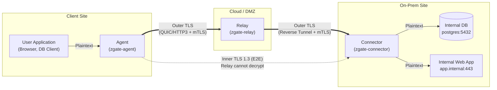
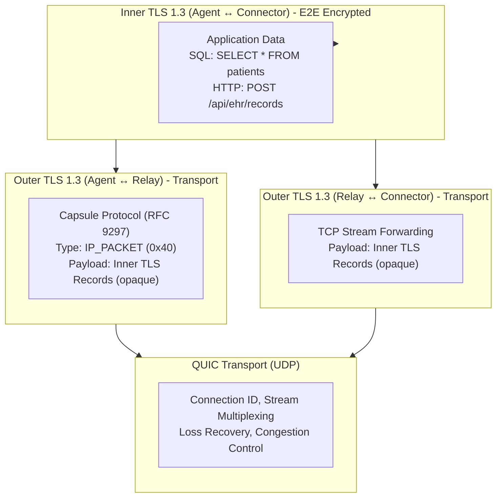
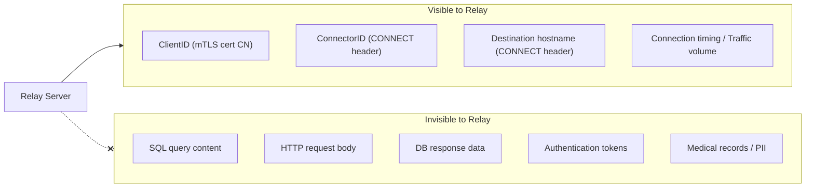
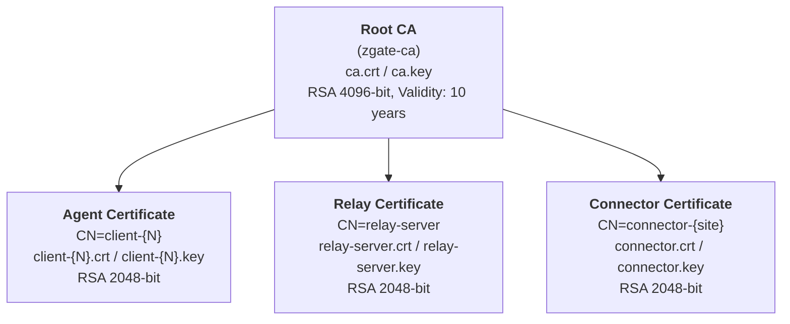
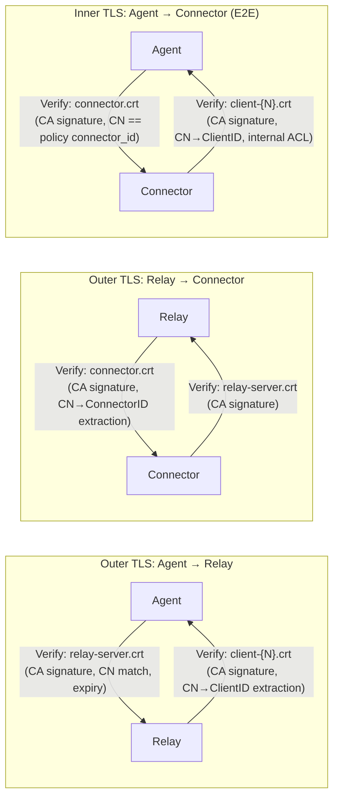
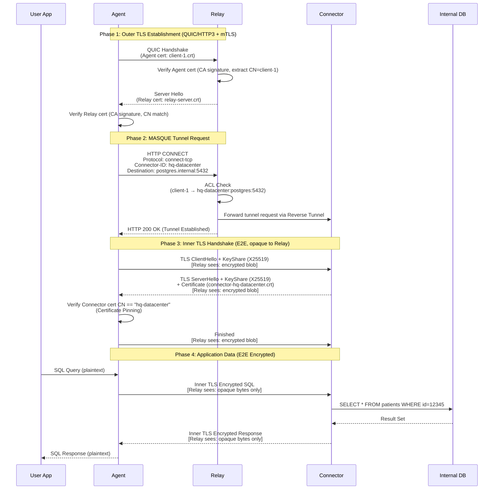
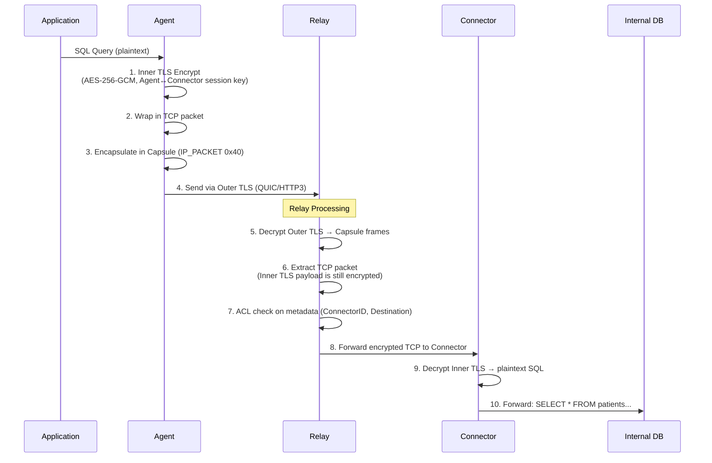
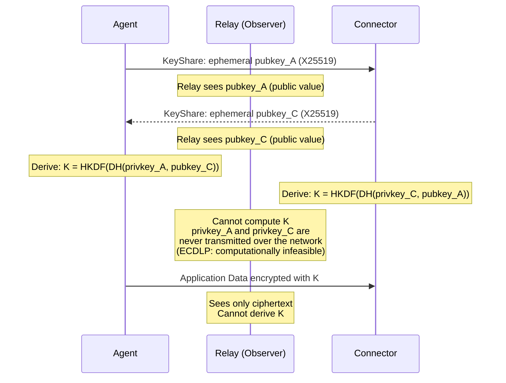
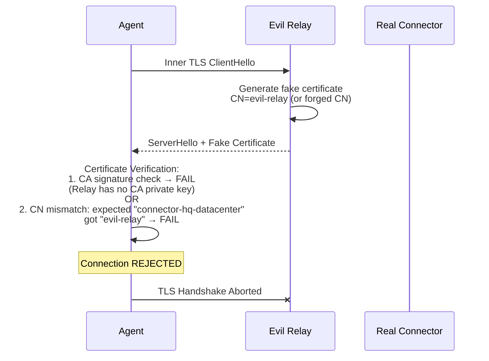

# End-to-End Encryption Design for zgate Connector

## 1. Executive Summary

This document defines the **E2E (End-to-End) encryption architecture between Agent (Client) and Connector** in zgate Connector.
The Relay server relays traffic but is **technically incapable of decrypting the communication content**.

**Security Goal:**
- **Visible to Relay**: Metadata (ClientID, ConnectorID, destination hostname)
- **Invisible to Relay**: Application data (SQL queries, HTTP requests, DB responses)

**Legal Requirements (Japan):**
The secrecy of communications is protected under Article 21(2) of the Japanese Constitution and Article 4 of the Telecommunications Business Act. If a Relay operator can access communication content, they face **criminal liability** (Article 179: imprisonment up to 2 years or fine up to 1 million yen). E2E encryption guarantees that the Relay is technically incapable of decryption. (See [Appendix A](#appendix-a-legal-background-details) for full legal background.)

**Implementation Status:** Planning (Phase 5.1)

---

## 2. System Architecture

### 2.1 Overall System Configuration



### 2.2 Nested TLS Architecture

Agent and Connector establish E2E encryption via **Inner TLS** through the Relay. The Relay terminates Outer TLS but can only see the Inner TLS payload as opaque encrypted bytes.



### 2.3 Protocol Layers

| Layer | Protocol | Encryption | Endpoints | Purpose |
|-------|----------|------------|-----------|---------|
| **Application** | HTTP/SQL/etc | None (over Inner TLS) | App ↔ Internal Resource | Business logic |
| **Inner TLS** | **TLS 1.3** | **Agent ↔ Connector** | Agent ↔ Connector | **E2E Encryption** |
| **Capsule/Tunnel** | RFC 9297 / TCP Stream | Part of Outer TLS | Agent ↔ Relay / Relay ↔ Connector | Packet encapsulation |
| **Outer TLS** | TLS 1.3 + mTLS | Hop-by-hop | Agent ↔ Relay, Relay ↔ Connector | Authentication & transport |
| **Transport** | QUIC (UDP) | QUIC encryption | Per-hop | Loss recovery, congestion |

### 2.4 Relay Visibility

The following clarifies what information the Relay can and cannot access.



---

## 3. Threat Model

### 3.1 Attack Scenarios

| Threat | Without E2E | With E2E |
|--------|------------|----------|
| **Relay Compromise** | All plaintext data leaked | Only metadata leaked |
| **Malicious Relay Operator** | Can log SQL/PII | Cannot decrypt application data |
| **Man-in-the-Middle (Relay)** | Can tamper with packets | Cannot tamper with encrypted payload |
| **Compliance Violation** | Medical data exposed to third party | E2E encrypted |
| **Telecom Business Act Art.4** | Criminal liability for operator | Technically incapable of decryption, compliant |

### 3.2 Trust Assumptions

**Trusted Components:**
- Agent (client device)
- Connector (on-premises gateway)
- Certificate Authority (CA)

**Untrusted Components:**
- **Relay Server** (public/untrusted relay node)
- Network between Agent ↔ Relay ↔ Connector

---

## 4. Certificate Infrastructure

### 4.1 Certificate Hierarchy



### 4.2 Component Certificate Matrix

Certificate files, purposes, and TLS roles held by each system component:

#### Agent (zgate-agent)

| File | Description | Used In | TLS Role |
|------|-------------|---------|----------|
| `ca.crt` | Root CA certificate | Outer TLS, Inner TLS | Validates Relay/Connector certificates |
| `client-{N}.crt` | Agent client certificate (CN=client-{N}) | Outer TLS (Agent → Relay) | mTLS Client Authentication |
| `client-{N}.key` | Agent private key | Outer TLS (Agent → Relay) | mTLS Client Authentication |

**TLS connection roles:**
- **Outer TLS (Agent → Relay)**: TLS Client (presents client certificate via mTLS)
- **Inner TLS (Agent → Connector)**: TLS Client (validates Connector server certificate)

#### Relay (zgate-relay)

| File | Description | Used In | TLS Role |
|------|-------------|---------|----------|
| `ca.crt` | Root CA certificate | Outer TLS (both directions) | Validates Agent/Connector certificates |
| `relay-server.crt` | Relay server certificate (CN=relay-server) | Outer TLS (Relay ← Agent) | TLS Server Authentication |
| `relay-server.key` | Relay private key | Outer TLS (Relay ← Agent) | TLS Server Authentication |

**TLS connection roles:**
- **Outer TLS (Agent → Relay)**: TLS Server (presents server certificate + validates Agent client certificate)
- **Outer TLS (Relay → Connector)**: TLS Client (authenticates via Relay certificate with mTLS)
- **Inner TLS**: **Not involved** (Agent ↔ Connector E2E traffic is relayed as opaque bytes only)

> **Important**: The Relay does not hold any Inner TLS certificates or private keys. This makes it cryptographically impossible for the Relay to decrypt Inner TLS sessions.

#### Connector (zgate-connector)

| File | Description | Used In | TLS Role |
|------|-------------|---------|----------|
| `ca.crt` | Root CA certificate | Outer TLS, Inner TLS | Validates Relay/Agent certificates |
| `connector.crt` | Connector server certificate (CN=connector-{site}) | Inner TLS (Connector ← Agent), Outer TLS (Connector ← Relay) | TLS Server Authentication |
| `connector.key` | Connector private key | Inner TLS, Outer TLS | TLS Server Authentication |

**TLS connection roles:**
- **Outer TLS (Relay → Connector)**: TLS Server (accepts Reverse Tunnel, validates Relay certificate)
- **Inner TLS (Agent → Connector)**: TLS Server (presents server certificate + validates Agent client certificate)

#### Certificate Authority (CA)

| File | Description | Location | Access |
|------|-------------|----------|--------|
| `ca.crt` | Root CA public certificate | Distributed to all components | Public |
| `ca.key` | Root CA private key | Secure storage (HSM or offline) | **Restricted** |

### 4.3 Certificate Validation Flow

Which component validates whose certificate, in which connection:



### 4.4 Certificate Details

#### Agent Certificate
```yaml
Subject:
  CN: client-{N}     # e.g., client-1, client-medical-staff
  O: MASQUE-Prod
  OU: Client
Extended Key Usage:
  - clientAuth
Validity: 90 days (cert-manager auto-rotation)
```

#### Relay Certificate
```yaml
Subject:
  CN: relay-server
  O: MASQUE-Prod
  OU: Relay
Extended Key Usage:
  - serverAuth
  - clientAuth          # Also used for connections to Connector
DNS SAN:
  - relay.zgate.svc.cluster.local
  - relay-server
Validity: 90 days
```

#### Connector Certificate
```yaml
Subject:
  CN: connector-{site}  # e.g., connector-hq-datacenter
  O: MASQUE-Prod
  OU: Connector
Extended Key Usage:
  - serverAuth          # Server for both Inner TLS and Outer TLS
  - clientAuth          # Optional: for Agent certificate verification
DNS SAN:
  - connector-{site}.internal
Validity: 90 days
```

---

## 5. Protocol Flow

### 5.1 Connection Establishment



### 5.2 Data Plane (Steady State)

**Upstream (Agent → Internal DB):**



---

## 6. Security Proofs

### 6.1 Relay Cannot Decrypt Inner TLS

Inner TLS performs key exchange using **X25519 ECDHE (Ephemeral Diffie-Hellman)**:



**Why the Relay cannot decrypt:**
1. **Forward Secrecy**: Session keys are derived from Ephemeral DH, independent of certificate private keys
2. **Private keys never shared**: `privkey_A` (Agent) and `privkey_C` (Connector) are never transmitted over the network
3. **ECDLP hardness**: Computing private keys from public keys (`pubkey_A`, `pubkey_C`) is computationally infeasible
4. **Relay holds no certificates**: The Relay does not possess any certificates or keys related to Inner TLS

Even if the Relay later obtains the long-term certificates of Agent or Connector, **decrypting past sessions is impossible** (Forward Secrecy).

### 6.2 Certificate Pinning Prevents MITM

Prevents a malicious Relay from impersonating a Connector:



**Defense mechanisms:**
- Agent verifies that the Connector certificate CN matches the `connector_id` in the ACL policy during Inner TLS
- Certificates must be signed by the trusted CA
- The Relay cannot forge a valid Connector certificate because it does not possess the CA private key

### 6.3 Metadata Leakage Analysis

| Metadata | Source | Risk | Mitigation |
|----------|--------|------|-----------|
| ClientID | mTLS cert | Low | Required for ACL |
| ConnectorID | CONNECT header | Low | Required for routing |
| Destination hostname | CONNECT header | Medium | Can be mitigated by using IP addresses |
| Connection timing | Observation | Medium | No practical mitigation |
| Traffic volume | TCP flow size | Medium | Padding (future) |
| Application protocol | N/A | **Protected** | Inner TLS prevents DPI |

---

## 7. Implementation Overview

### 7.1 Agent: Inner TLS Client

```go
// agent/connector_client.go
type ConnectorDialer struct {
    relayConn   io.ReadWriter  // Outer TLS tunnel to Relay
    connectorID string
    caCertPool  *x509.CertPool
}

func (d *ConnectorDialer) DialConnector() (net.Conn, error) {
    innerTLSConfig := &tls.Config{
        RootCAs:    d.caCertPool,
        ServerName: d.connectorID, // Must match Connector cert CN
        MinVersion: tls.VersionTLS13,
    }
    innerConn := tls.Client(d.relayConn, innerTLSConfig)
    if err := innerConn.Handshake(); err != nil {
        return nil, fmt.Errorf("inner TLS handshake failed: %w", err)
    }
    // Verify Connector certificate CN
    peerCN := innerConn.ConnectionState().PeerCertificates[0].Subject.CommonName
    if peerCN != d.connectorID {
        return nil, fmt.Errorf("connector CN mismatch: got %s, want %s", peerCN, d.connectorID)
    }
    return innerConn, nil
}
```

### 7.2 Relay: Opaque Byte Proxy

```go
// relay/connector_proxy.go
func handleConnectorRequest(w http.ResponseWriter, r *http.Request) {
    connectorID := r.Header.Get("Connector-ID")
    clientID := extractClientID(r)

    // ACL check on metadata ONLY (cannot inspect payload)
    if aclEngine.CheckConnectorAccess(clientID, connectorID, destination) == acl.ActionDeny {
        w.WriteHeader(http.StatusForbidden)
        return
    }

    connector := sessionManager.GetConnectorByID(connectorID)
    w.WriteHeader(http.StatusOK)

    // Bidirectional copy of OPAQUE byte streams
    // Relay CANNOT decrypt Inner TLS payload
    go io.Copy(connector.Upstream, r.Body)    // Agent → Connector (encrypted)
    io.Copy(w, connector.Downstream)          // Connector → Agent (encrypted)
}
```

### 7.3 Connector: Inner TLS Server

```go
// connector/server.go
func acceptInnerTLS(relayConn net.Conn) {
    innerTLSConfig := &tls.Config{
        Certificates: []tls.Certificate{loadConnectorCert()},
        ClientAuth:   tls.RequireAndVerifyClientCert,
        ClientCAs:    loadCACertPool(),
        MinVersion:   tls.VersionTLS13,
    }
    innerConn := tls.Server(relayConn, innerTLSConfig)
    if err := innerConn.Handshake(); err != nil {
        return
    }
    agentClientID := innerConn.ConnectionState().PeerCertificates[0].Subject.CommonName
    // Connector can now see plaintext application data
    go proxyToInternal(innerConn, "postgres.internal:5432")
}
```

---

## 8. Operational Security

### 8.1 Certificate Rotation

```yaml
# cert-manager Certificate resource example
apiVersion: cert-manager.io/v1
kind: Certificate
metadata:
  name: connector-hq-datacenter
spec:
  secretName: connector-hq-datacenter-tls
  duration: 2160h       # 90 days
  renewBefore: 720h     # 30 days before expiry
  commonName: connector-hq-datacenter
  usages: [server auth, client auth]
  issuerRef:
    name: zgate-ca-issuer
```

Rotation process:
1. cert-manager renews certificates 30 days before expiry
2. Connector detects certificate file changes via fsnotify and reloads
3. Existing connections continue with the old certificate; new connections use the new one
4. Zero downtime

### 8.2 Audit Logging

**Relay Audit Log (metadata only):**
```json
{
  "timestamp": "2026-01-11T10:30:45Z",
  "event": "connector_access",
  "client_id": "client-medical-staff",
  "connector_id": "connector-hq-datacenter",
  "destination": "postgres.internal:5432",
  "action": "ALLOW"
}
```

**Not logged:** SQL query content, HTTP request body, DB responses, authentication tokens

**Connector Audit Log (full visibility):**
```json
{
  "timestamp": "2026-01-11T10:30:46Z",
  "event": "sql_query",
  "client_id": "client-medical-staff",
  "query_type": "SELECT",
  "affected_tables": ["patients"]
}
```

### 8.3 Incident Response: Relay Compromise

| Category | Impact | Note |
|----------|--------|------|
| **Protected** | Application data, DB credentials, Past sessions | Inner TLS + Forward Secrecy |
| **Exposed** | Metadata (who connected where), Connection timing | Inherent in relay architecture |

Response procedure:
1. Revoke Relay certificate (CRL/OCSP)
2. Audit metadata logs
3. Application data is protected by E2E encryption

---

## 9. Performance Considerations

| Metric | Without E2E | With E2E | Overhead |
|--------|------------|----------|---------|
| RTT | ~50ms | ~70ms | +20ms (Inner TLS handshake) |
| Throughput | N/A | ~10 GB/s (AES-GCM HW accel) | Negligible |
| Reconnection | N/A | ~50ms (TLS 1.3 0-RTT resumption) | Minimal |

TLS 1.3 Session Resumption (0-RTT) minimizes reconnection latency:

```go
innerTLSConfig := &tls.Config{
    ClientSessionCache: tls.NewLRUClientSessionCache(128),
}
```

---

## 10. Testing & Validation

### 10.1 Relay Decryption Impossibility Test

```bash
# Enable Relay debug logging and verify Inner TLS payload is not logged in plaintext
export DEBUG_LOG_ENCRYPTED_PAYLOAD=true

# Send SQL query from Agent
echo "SELECT * FROM patients WHERE ssn='123-45-6789'" | psql -h connector-db

# Verify Relay logs do not contain plaintext SQL
grep "SELECT" /var/log/zgate/relay.log
# Expected: No match (Relay cannot see plaintext)
```

### 10.2 Certificate Pinning Test

```bash
# Configure Agent with incorrect Connector CN
# Expected: "connector CN mismatch" error, connection rejected
./zgate-agent --connector-id wrong-connector
```

### 10.3 Forward Secrecy Test

```bash
# 1. Capture encrypted traffic
tcpdump -i any -w /tmp/capture.pcap port 4433

# 2. Attempt decryption using Agent/Connector long-term certificate private keys
# Expected: Inner TLS payload cannot be decrypted (Forward Secrecy)
```

---

## 11. Future Enhancements

- **Post-Quantum Cryptography**: Use X25519Kyber768Draft00 (Hybrid ECDH + Kyber) for Inner TLS
- **Traffic Padding**: Fixed-size block padding as a countermeasure against traffic analysis attacks
- **Application-Level Encryption**: Encryption of ultra-sensitive fields (e.g., SSN) that even the Connector cannot decrypt

---

## Appendix A: Legal Background Details

### A.1 Constitution of Japan, Article 21(2)
> "No censorship shall be maintained, nor shall the secrecy of any means of communication be violated."

Prohibits **all entities**, including telecommunications carriers, from censoring, disclosing, or using communication content.

### A.2 Telecommunications Business Act

**Article 4 (Protection of Secrecy of Communications):**
> "The secrecy of communications handled by a telecommunications carrier shall not be violated."

**Article 179 (Penalties):**
- Violation of communication secrecy: **imprisonment up to 2 years or fine up to 1 million yen**

**Article 164(2) (Technical Compliance Requirements):**
> Telecommunications carriers must implement **technical measures** to prevent unauthorized access to communications.

### A.3 Ministry of Internal Affairs and Communications (MIC) Guidelines

> "When a telecommunications carrier operates a relay server that is **technically capable of accessing communication content**, E2E encryption must be implemented so that the relay server **cannot decrypt** the content."

### A.4 Act on the Protection of Personal Information

Medical records are classified as **"Special Care-Required Personal Information"** (Article 2(3)), requiring strict handling.
Unauthorized disclosure: **imprisonment up to 1 year or fine up to 500,000 yen** (Article 177)

### A.5 International Comparison

| Jurisdiction | Framework | Criminal Penalty | E2E Required? |
|-------------|-----------|-----------------|---------------|
| **Japan** | Constitution Art.21 + Telecom Business Act Art.4 | 2 years imprisonment | **Yes** (MIC interpretation) |
| **USA** | ECPA + Wiretap Act | 5 years imprisonment | Depends (HIPAA for medical) |
| **EU** | GDPR + ePrivacy Directive | 4% of revenue | Recommended |

---

## Appendix B: Compliance Summary

### HIPAA (USA)

| Requirement | Implementation | Status |
|------------|----------------|--------|
| Access Control | mTLS + ACL | Compliant |
| Transmission Security | TLS 1.3 E2E | Compliant |
| Encryption | AES-256-GCM | Compliant |
| Audit Controls | Structured logging | Compliant |

### NIST SP 800-207 (Zero Trust)

1. **Never trust, always verify**: mTLS at all layers
2. **Least privilege**: Per-client/connector ACL
3. **Assume breach**: E2E encryption protects data even if Relay is compromised
4. **Microsegmentation**: Per-connector access control

---

## Appendix C: Glossary

| Term | Definition |
|------|------------|
| **E2E Encryption** | Encryption where only the endpoints can decrypt |
| **Inner TLS** | TLS session between Agent ↔ Connector (E2E) |
| **Outer TLS** | TLS session between Agent ↔ Relay / Relay ↔ Connector (Transport) |
| **Forward Secrecy** | Property ensuring past sessions cannot be decrypted even if long-term keys are compromised |
| **Certificate Pinning** | Verification that a peer certificate CN matches the expected policy ID |
| **AEAD** | Authenticated Encryption with Associated Data (e.g., AES-GCM) |
| **mTLS** | Mutual TLS (both client and server present certificates) |

---

## Appendix D: References

### Technical Standards
- **RFC 8446**: TLS 1.3
- **RFC 9484**: Proxying IP in HTTP (MASQUE CONNECT-IP)
- **RFC 9297**: HTTP Datagrams and the Capsule Protocol
- **NIST SP 800-207**: Zero Trust Architecture

### Legal
- **Constitution of Japan**: Article 21(2)
- **Telecommunications Business Act**: Articles 4, 164(2), 179
- **Act on the Protection of Personal Information**: Articles 2(3), 177
- **MIC Guidelines**: Guidelines on Protection of Secrecy of Communications
- **HIPAA Security Rule**: 45 CFR § 164.312

---

**Document Version:** 2.1
**Last Updated:** 2026-02-11
**Status:** Planning (Phase 5.1)
