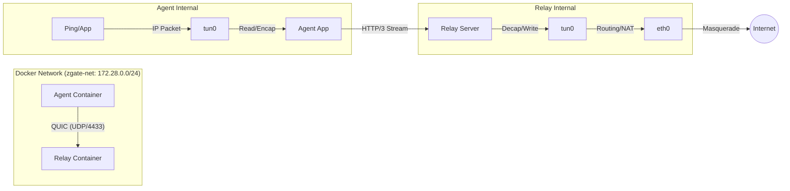

# zgate ZTNA Project Documentation

## 1. Project Overview

**Name:** zgate (Zero Trust Network Access Gateway)
**Goal:** Implement a Hub-Spoke ZTNA solution using **MASQUE (Multiplexed Application Substrate over QUIC Encryption)**.
**Key Standard:** RFC 9484 (IP Proxying support for HTTP).
**Use Case:** Secure access for medical institutions to SaaS (Split Tunnel) and On-prem resources (Connector).

## 2. Tech Stack & Environment

* **Language:** Go `1.25.5`
* **Architecture:** Hybrid Go Monorepo with go.work
* **Base Image:** Debian Bookworm (via Docker)
* **Core Libraries:**
  * QUIC/HTTP3: `github.com/quic-go/quic-go`
  * TUN/TAP: `github.com/songgao/water`
  * Packet Analysis: `github.com/google/gopacket`
* **Container Runtime:** Docker Compose (v2)
* **Deployment:**
  * **Host:** macOS (Development environment)
  * **Container:** Linux (Production-like environment for routing isolation)

## 3. System Architecture & Current Implementation

### 3.1 Hub-and-Spoke Model

* **Agent (Spoke):** Creates a TUN interface, captures OS packets, encapsulates them in HTTP/3, and sends them to the Relay.
* **Relay (Hub):** Terminates QUIC connections, decapsulates packets, writes them to its own TUN interface, and routes them to the destination (Internet) via NAT.

### 3.2 Network Flow (Docker Environment)



### 3.3 Current Tunneling Mechanism (Phase 2)

* **Method:** HTTP/3 **Stream Tunneling** (Request/Response Body)
* **Framing:** Simple Length-Prefixed framing to handle packet boundaries in a stream
  * Format: `[Length (uint16 big-endian)] [IP Packet Payload]`
* **Method:** `CONNECT`
* **Header:** `Protocol: connect-ip` (RFC 9484 adherence)

## 4. Directory Structure (Hybrid Monorepo)

```text
zgate/
├── go.mod                          # Root go.mod (relay, connector, shared code)
├── go.sum
├── go.work                         # Go workspace (development)
├── go.work.sum
│
├── cmd/                            # Binary entry points
│   └── zgate-relay/
│       └── main.go
│
├── agent/                          # Agent (isolated go.mod)
│   ├── go.mod
│   ├── go.sum
│   ├── main.go
│   ├── net_linux.go
│   └── net_darwin.go
│
├── relay/                          # Relay server packages
│   ├── main.go                     # Relay entry point
│   ├── acl/                        # Access Control List
│   ├── audit/                      # Structured audit logging
│   ├── policy/                     # Policy storage abstraction
│   ├── ipam/                       # IP Address Management
│   ├── session/                    # Session management
│   └── internal/                   # Platform-specific helpers
│
├── internal/                       # Private packages (deprecated)
│   └── relay/
│       ├── net_linux.go
│       └── net_darwin.go
│
├── pkg/                            # Shared libraries (future)
│   ├── protocol/                   # Framing, constants
│   ├── cert/                       # TLS utilities
│   └── tunutil/                    # TUN interface helpers
│
├── deployments/
│   └── docker/
│       ├── relay.Dockerfile
│       ├── agent.Dockerfile
│       ├── compose.yaml
│       ├── relay-entrypoint.sh
│       └── agent-entrypoint.sh
│
├── scripts/
│   ├── generate-certs.sh           # Certificate generation
│   └── test-acl.sh                 # ACL E2E test script
│
├── certs/                          # Generated certificates (gitignored)
├── policy.yaml                     # ACL policy configuration
│
├── docs/
│   ├── architecture/
│   │   └── phase-3.2-acl-plan.md   # Phase 3.2 implementation plan
│   ├── packet-flow.md
│   └── FAQ.md
│
├── Makefile                        # Build automation
├── README.md
└── CLAUDE.md -> GEMINI.md          # Project context
```

### Monorepo Architecture Rationale

**Why Hybrid (Agent isolated, Server components share)?**

1. **Agent Isolation:**
   - Independent `agent/go.mod` with minimal dependencies
   - Binary distributed to end users (size matters)
   - Prevents accidental bloat from server dependencies
   - Enables independent version upgrades

2. **Server Components Share:**
   - Relay and future Connector use root `go.mod`
   - Share heavy dependencies (DB drivers, policy engine)
   - Coordinated deployment (both are datacenter services)

3. **go.work Benefits:**
   - Seamless development across modules
   - IDE support works out of the box
   - `go test ./...` tests entire codebase
   - Lower friction than full multi-module setup

**Binary Sizes (Phase 3.1):**
- `zgate-relay`: 11MB (CGO_ENABLED=1, stripped)
- `zgate-agent`: 12MB (CGO_ENABLED=1, stripped)

## 5. Security & Configuration Constraints

1. **Least Privilege:**
   * Do **NOT** use `privileged: true` in Docker Compose
   * Use `cap_add: [NET_ADMIN]` and `devices: [/dev/net/tun:/dev/net/tun]`

2. **Routing Isolation:**
   * Agent and Relay must run in separate network namespaces (Docker containers) to avoid routing loops

3. **TLS:**
   * Using mTLS with CA-signed client certificates
   * TLS 1.3 minimum version enforced
   * Certificate generation via `scripts/generate-certs.sh`

## 6. Current Status

* [x] **Phase 1: Local TUN/TAP** - Can read/write IP packets from OS
* [x] **Phase 2: Stream-based Tunneling**
  * End-to-End Ping (`agent` -> `relay` -> `8.8.8.8`) works with 100% reliability
  * Routing loop resolved via Docker network isolation
  * NAT (IP Masquerade) configured on Relay
  * Length-prefixed framing ensures reliable packet boundaries over HTTP/3 streams
* [x] **Phase 3.1: mTLS Authentication**
  * Client certificate-based authentication
  * Client ID extraction from CN field
  * TLS 1.3 enforcement
* [x] **Phase 3.2: ACL (Access Control List)** - ✅ Completed
  * **Phase 3.2.1: ACL Foundation** ✅
    * YAML-based policy engine with IP CIDR matching
    * Structured audit logging (JSON format to stdout)
    * Client-specific rule enforcement (first-match-wins)
    * Default deny policy with explicit allow rules
  * **Phase 3.2.2: IPAM (IP Address Management)** ✅
    * Dynamic Virtual IP allocation (10.100.0.2-254)
    * ClientID-based deterministic allocation (same client = same IP)
    * Dual-index session manager (routing + admin lookups)
    * HTTP 503 on IP pool exhaustion
    * 94.4% test coverage (IPAM), 80.3% (session manager)
  * **Phase 3.2.3: ACL-IPAM Integration** ✅
    * Virtual IP dynamic allocation via HTTP headers
    * Agent auto-configuration from Relay
    * ACL enforcement in upstream packet path
    * Multi-client E2E validation passed
* [ ] **Phase 3.3+: Connector & Advanced Features**
  * On-prem Connector (reverse tunnel)
  * FQDN-based ACL
  * Policy management API
  * IPAM persistence (optional)

## 7. How to Run (Development)

```bash
# 1. Generate certificates (first time only)
make certs

# 2. Start environment (rebuilds images)
cd deployments/docker
docker compose up --build

# 3. Verify connectivity (from separate terminal)
docker compose exec agent-1 ping -c 4 8.8.8.8
docker compose exec agent-2 ping -c 4 8.8.8.8

# 4. Check IPAM allocation logs
docker compose logs relay | grep "Virtual IP"
```

### E2E Tests

```bash
make e2e
```

### Test ACL Enforcement

```bash
bash scripts/test-acl.sh
```

### Build Binaries

```bash
# Build all
make all

# Build individual components
make relay    # Builds zgate-relay
make agent    # Builds zgate-agent

# Clean build artifacts
make clean
```

## 8. Protocol Specifications

### 8.1 Virtual IP Assignment (Phase 3.2.3)

**HTTP Headers for Configuration Exchange:**

When a client establishes a CONNECT tunnel, the Relay sends Virtual IP configuration via custom HTTP response headers:

| Header Name | Description | Example Value | Required |
|------------|-------------|---------------|----------|
| `Zgate-Virtual-IP` | Allocated Virtual IP for the client | `10.100.0.2` | Yes |
| `Zgate-Gateway-IP` | Relay gateway IP address | `10.100.0.1` | Yes |
| `Zgate-Subnet-Mask` | Virtual network subnet mask | `255.255.255.0` | Yes |

**Flow:**
1. Agent sends HTTP CONNECT request to Relay
2. Relay allocates Virtual IP via IPAM
3. Relay responds with HTTP 200 OK + headers
4. Agent reads headers and configures TUN interface dynamically
5. Tunnel established with assigned Virtual IP

**Error Handling:**
- Missing headers → Agent returns error and retries
- IP pool exhaustion → Relay returns HTTP 503 Service Unavailable

---

### 8.2 Session Manager Architecture

**Purpose:** Dual-index session lookup for efficient routing and administration

**Data Structures:**

```go
type Manager struct {
    byVirtualIP sync.Map  // string (IP) → *ClientSession (for packet routing)
    byClientID  sync.Map  // string (ClientID) → *ClientSession (for ACL/admin)
    allocator   ipam.Allocator
    mu          sync.Mutex
}
```

**Key Operations:**

| Method | Use Case | Lookup Key | Performance |
|--------|----------|------------|-------------|
| `Create(sess)` | New client connection | N/A | O(1) |
| `Delete(sess)` | Client disconnect | N/A | O(1) |
| `GetByVirtualIP(ip)` | Packet routing (dst IP → session) | Virtual IP | O(1) |
| `GetByClientID(id)` | ACL checks, admin queries | Client ID (CN) | O(1) |

**Lifecycle:**
1. Client connects → `Create()` allocates Virtual IP, stores in both indexes
2. Packet arrives from internet → `GetByVirtualIP()` finds destination session
3. Packet arrives from client → `GetByClientID()` retrieves ClientID for ACL check
4. Client disconnects → `Delete()` releases IP, removes from both indexes

**Thread Safety:**
- Uses `sync.Map` for concurrent read/write access
- Global mutex protects IPAM allocation/release operations
- Supports 253 concurrent clients (10.100.0.2-254)

---

### 8.3 ACL Enforcement Flow

**Packet Path with ACL:**

```
Client → TUN → Agent → HTTP/3 CONNECT Body → Relay
                                               ↓
                                    Extract PacketInfo (IP/port)
                                               ↓
                                    Lookup ClientID (from mTLS cert)
                                               ↓
                                    aclEngine.CheckAccess(clientID, packetInfo)
                                               ↓
                                    ┌──────────┴──────────┐
                                  ALLOW                 DENY
                                    ↓                     ↓
                              Write to TUN          Drop packet
                              Audit log (INFO)      Audit log (WARN)
                                    ↓
                              NAT → Internet
```

**PacketInfo Extraction:**
- Uses `gopacket` to parse IP headers
- Extracts: SrcIP, DstIP, Protocol, SrcPort, DstPort (TCP/UDP only)
- Invalid packets (malformed, non-IPv4) are silently dropped

**ACL Decision:**
- First-match-wins rule evaluation
- Logs every decision (ALLOW/DENY) to audit logger
- DENY → packet dropped at Relay, client receives no response (silent drop)

---

### 8.4 Agent Routing Configuration

**Split-Tunnel Architecture:**

To route all traffic through TUN while maintaining Relay connectivity, the Agent uses a split default route approach:

```bash
# Virtual network routes (covers entire IPv4 space)
0.0.0.0/1 via 10.100.0.1 dev tun0        # 0.0.0.0 - 127.255.255.255
128.0.0.0/1 via 10.100.0.1 dev tun0      # 128.0.0.0 - 255.255.255.255

# Physical network route (for Relay connection)
default via 172.28.0.1 dev eth0          # Docker network gateway
```

**Why Split Route?**
- Cannot use `0.0.0.0/0` directly (conflicts with default route)
- Relay connection must go through physical interface (eth0)
- Splitting into two `/1` routes achieves full coverage without conflict
- More specific routes (TUN /1) take precedence over default route

**Configuration:**
- `TargetCIDR` constant: `"0.0.0.0/1,128.0.0.0/1"`
- Agent parses comma-separated CIDRs and adds each route
- Routes configured after receiving Virtual IP from Relay

**Verification:**
```bash
# Check agent routing table
docker compose exec agent-1 ip route

# Should show both /1 routes pointing to tun0
```

---

## 9. Next Steps

### Phase 3.3: On-prem Connector (Future)
- Reverse tunnel for internal resources
- Extend ACL for connector routing
- IPAM persistence for production deployments

### Phase 4: Policy Management API (Future)
- REST API for dynamic policy updates
- Database backend for policy storage
- Web UI for administration

## 10. Development Workflow

### Working with go.work

```bash
# Clone repository
git clone https://github.com/guni1192/zgate
cd zgate

# go.work is already configured - builds work immediately
go build ./cmd/zgate-relay     # Uses root go.mod
cd agent && go build .          # Uses agent/go.mod
cd .. && go test ./...          # Tests all modules
```

### Adding Dependencies

**For relay/server components:**
```bash
go get <package>
go mod tidy
```

**For agent:**
```bash
cd agent
go get <package>
go mod tidy
```

### Docker Development

```bash
# Start development environment
make dev-up

# View logs
make logs-relay
make logs-agent

# Stop environment
make dev-down
```

## 11. References

- **MASQUE Protocol**: [RFC 9484](https://www.rfc-editor.org/rfc/rfc9484.html)
- **QUIC Go**: [github.com/quic-go/quic-go](https://github.com/quic-go/quic-go)
- **TUN/TAP (water)**: [github.com/songgao/water](https://github.com/songgao/water)
- **Architecture Documentation**: `docs/architecture/`
