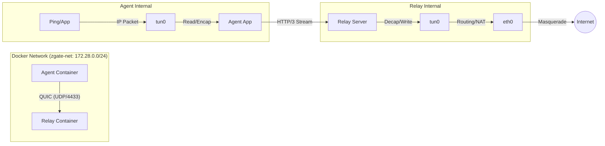

# zgate ZTNA Project Documentation

## 1. Project Overview

**Name:** zgate (Zero Trust Network Access Gateway)
**Goal:** Implement a Hub-Spoke ZTNA solution using **MASQUE (Multiplexed Application Substrate over QUIC Encryption)**.
**Key Standard:** RFC 9484 (IP Proxying support for HTTP).
**Use Case:** Secure access for medical institutions to SaaS (Split Tunnel) and On-prem resources (Connector).

## 2. Tech Stack & Environment

* **Language:** Go `1.25.5`
* **Architecture:** Hybrid Go Monorepo with go.work
* **Base Image:** Debian Bookworm (via Docker)
* **Core Libraries:**
  * QUIC/HTTP3: `github.com/quic-go/quic-go`
  * TUN/TAP: `github.com/songgao/water`
  * Packet Analysis: `github.com/google/gopacket`
* **Container Runtime:** Docker Compose (v2)
* **Deployment:**
  * **Host:** macOS (Development environment)
  * **Container:** Linux (Production-like environment for routing isolation)

## 3. System Architecture & Current Implementation

### 3.1 Hub-and-Spoke Model

* **Agent (Spoke):** Creates a TUN interface, captures OS packets, encapsulates them in HTTP/3, and sends them to the Relay.
* **Relay (Hub):** Terminates QUIC connections, decapsulates packets, writes them to its own TUN interface, and routes them to the destination (Internet) via NAT.

### 3.2 Network Flow (Docker Environment)



### 3.3 Capsule Protocol (RFC 9297)

* **Method:** HTTP/3 **Stream Tunneling** with RFC 9297 Capsule Protocol
* **Framing:** QUIC Variable-Length Integer (Varint) based capsule framing
  * Format: `[Type (varint)] [Length (varint)] [Value]`
  * Type 0x01: ADDRESS_ASSIGN (RFC 9484 - Virtual IP allocation)
  * Type 0x40: IP_PACKET (IP packet encapsulation)
* **HTTP Method:** `CONNECT`
* **HTTP Header:** `Protocol: connect-ip` (RFC 9484 adherence)
* **Benefits:**
  * Standards-compliant (RFC 9297, RFC 9484, RFC 9000)
  * Extensible capsule type system
  * Efficient QUIC varint encoding
  * No backward compatibility needed (not in production yet)

## 4. Directory Structure (Hybrid Monorepo)

```text
zgate/
├── go.mod                          # Root go.mod (relay, connector, shared code)
├── go.sum
├── go.work                         # Go workspace (development)
├── go.work.sum
│
├── cmd/                            # Binary entry points
│   └── zgate-relay/
│       └── main.go
│
├── agent/                          # Agent (isolated go.mod)
│   ├── go.mod
│   ├── go.sum
│   ├── main.go
│   ├── net_linux.go
│   └── net_darwin.go
│
├── relay/                          # Relay server packages
│   ├── main.go                     # Relay entry point
│   ├── acl/                        # Access Control List
│   ├── audit/                      # Structured audit logging
│   ├── policy/                     # Policy storage abstraction
│   ├── ipam/                       # IP Address Management
│   ├── session/                    # Session management
│   └── internal/                   # Platform-specific helpers
│
├── internal/                       # Private packages (deprecated)
│   └── relay/
│       ├── net_linux.go
│       └── net_darwin.go
│
├── pkg/                            # Shared libraries
│   └── capsule/                    # RFC 9297 Capsule Protocol implementation
│       ├── types.go                # Capsule type definitions
│       ├── varint.go               # RFC 9000 QUIC Varint encoding/decoding
│       ├── frame.go                # Capsule framing/deframing
│       ├── reader.go               # Stream reader
│       ├── writer.go               # Stream writer (thread-safe)
│       ├── ipconfig.go             # ADDRESS_ASSIGN capsule (RFC 9484)
│       ├── ippacket.go             # IP_PACKET capsule helpers
│       └── *_test.go               # Unit tests (86.6% coverage)
│
├── deployments/
│   └── docker/
│       ├── relay.Dockerfile
│       ├── agent.Dockerfile
│       ├── compose.yaml
│       ├── relay-entrypoint.sh
│       └── agent-entrypoint.sh
│
├── scripts/
│   ├── generate-certs.sh           # Certificate generation
│   └── test-acl.sh                 # ACL E2E test script
│
├── certs/                          # Generated certificates (gitignored)
├── policy.yaml                     # ACL policy configuration
│
├── docs/
│   ├── architecture/
│   │   └── phase-3.2-acl-plan.md   # Phase 3.2 implementation plan
│   ├── packet-flow.md
│   └── FAQ.md
│
├── Makefile                        # Build automation
├── README.md
└── CLAUDE.md -> GEMINI.md          # Project context
```

### Monorepo Architecture Rationale

**Why Hybrid (Agent isolated, Server components share)?**

1. **Agent Isolation:**
   - Independent `agent/go.mod` with minimal dependencies
   - Binary distributed to end users (size matters)
   - Prevents accidental bloat from server dependencies
   - Enables independent version upgrades

2. **Server Components Share:**
   - Relay and future Connector use root `go.mod`
   - Share heavy dependencies (DB drivers, policy engine)
   - Coordinated deployment (both are datacenter services)

3. **go.work Benefits:**
   - Seamless development across modules
   - IDE support works out of the box
   - `go test ./...` tests entire codebase
   - Lower friction than full multi-module setup

**Binary Sizes (Phase 3.1):**
- `zgate-relay`: 11MB (CGO_ENABLED=1, stripped)
- `zgate-agent`: 12MB (CGO_ENABLED=1, stripped)

## 5. Security & Configuration Constraints

1. **Least Privilege:**
   * Do **NOT** use `privileged: true` in Docker Compose
   * Use `cap_add: [NET_ADMIN]` and `devices: [/dev/net/tun:/dev/net/tun]`

2. **Routing Isolation:**
   * Agent and Relay must run in separate network namespaces (Docker containers) to avoid routing loops

3. **TLS:**
   * Using mTLS with CA-signed client certificates
   * TLS 1.3 minimum version enforced
   * Certificate generation via `scripts/generate-certs.sh`

## 6. Current Status

* [x] **Phase 1: Local TUN/TAP** - Can read/write IP packets from OS
* [x] **Phase 2: Stream-based Tunneling** (Replaced by Capsule Protocol)
  * ~~Length-prefixed framing~~ → Migrated to RFC 9297 Capsule Protocol
  * End-to-End Ping (`agent` -> `relay` -> `8.8.8.8`) works with 100% reliability
  * Routing loop resolved via Docker network isolation
  * NAT (IP Masquerade) configured on Relay
* [x] **Phase 3.1: mTLS Authentication**
  * Client certificate-based authentication
  * Client ID extraction from CN field
  * TLS 1.3 enforcement
* [x] **Phase 3.2: ACL (Access Control List)** - ✅ Completed
  * **Phase 3.2.1: ACL Foundation** ✅
    * YAML-based policy engine with IP CIDR matching
    * Structured audit logging (JSON format to stdout)
    * Client-specific rule enforcement (first-match-wins)
    * Default deny policy with explicit allow rules
  * **Phase 3.2.2: IPAM (IP Address Management)** ✅
    * Dynamic Virtual IP allocation (10.100.0.2-254)
    * ClientID-based deterministic allocation (same client = same IP)
    * Dual-index session manager (routing + admin lookups)
    * HTTP 503 on IP pool exhaustion
    * 94.4% test coverage (IPAM), 80.3% (session manager)
  * **Phase 3.2.3: ACL-IPAM Integration** ✅
    * ~~Virtual IP dynamic allocation via HTTP headers~~ → Migrated to ADDRESS_ASSIGN capsule
    * Agent auto-configuration from Relay
    * ACL enforcement in upstream packet path
    * Multi-client E2E validation passed
* [x] **Phase 3.3: RFC 9297 Capsule Protocol Migration** - ✅ Completed
  * RFC 9297 Capsule Protocol implementation (pkg/capsule package)
  * RFC 9000 QUIC Varint encoding/decoding
  * RFC 9484 ADDRESS_ASSIGN capsule for Virtual IP allocation
  * IP_PACKET capsule (Type 0x40) for packet encapsulation
  * 86.6% test coverage with comprehensive unit tests
  * Complete migration from Length-Prefix to Capsule Protocol
  * No backward compatibility required (not in production)
  * E2E tests passing with 0% packet loss
* [ ] **Phase 3.4+: Connector & Advanced Features**
  * On-prem Connector (reverse tunnel)
  * FQDN-based ACL
  * Policy management API
  * IPAM persistence (optional)

## 7. How to Run (Development)

```bash
# 1. Generate certificates (first time only)
make certs

# 2. Start environment (rebuilds images)
cd deployments/docker
docker compose up --build

# 3. Verify connectivity (from separate terminal)
docker compose exec agent-1 ping -c 4 8.8.8.8
docker compose exec agent-2 ping -c 4 8.8.8.8

# 4. Check IPAM allocation logs
docker compose logs relay | grep "Virtual IP"
```

### E2E Tests

```bash
make e2e
```

### Test ACL Enforcement

```bash
bash scripts/test-acl.sh
```

### Build Binaries

```bash
# Build all
make all

# Build individual components
make relay    # Builds zgate-relay
make agent    # Builds zgate-agent

# Clean build artifacts
make clean
```

## 8. Protocol Specifications

### 8.1 Virtual IP Assignment (Phase 3.3 - Capsule Protocol)

**ADDRESS_ASSIGN Capsule (RFC 9484):**

When a client establishes a CONNECT tunnel, the Relay sends Virtual IP configuration via RFC 9484 ADDRESS_ASSIGN capsule:

**Capsule Format:**
```
Type:   0x01 (ADDRESS_ASSIGN)
Length: Variable
Value:  [Assignment Count (varint)]
        For each assignment:
          - Request ID (varint)
          - IP Version (1 byte): 4 or 6
          - IP Address (4 or 16 bytes)
          - Prefix Length (1 byte)
```

**Flow:**
1. Agent sends HTTP CONNECT request to Relay
2. Relay allocates Virtual IP via IPAM
3. Relay responds with HTTP 200 OK
4. Relay sends ADDRESS_ASSIGN capsule as first capsule
5. Agent reads and decodes ADDRESS_ASSIGN capsule
6. Agent configures TUN interface with assigned IP
7. Subsequent capsules are IP_PACKET (Type 0x40)

**Error Handling:**
- Invalid capsule type → Agent returns error
- IP pool exhaustion → Relay returns HTTP 503 Service Unavailable
- Decode failure → Agent logs error and disconnects

---

### 8.2 Session Manager Architecture

**Purpose:** Dual-index session lookup for efficient routing and administration

**Data Structures:**

```go
type Manager struct {
    byVirtualIP sync.Map  // string (IP) → *ClientSession (for packet routing)
    byClientID  sync.Map  // string (ClientID) → *ClientSession (for ACL/admin)
    allocator   ipam.Allocator
    mu          sync.Mutex
}
```

**Key Operations:**

| Method | Use Case | Lookup Key | Performance |
|--------|----------|------------|-------------|
| `Create(sess)` | New client connection | N/A | O(1) |
| `Delete(sess)` | Client disconnect | N/A | O(1) |
| `GetByVirtualIP(ip)` | Packet routing (dst IP → session) | Virtual IP | O(1) |
| `GetByClientID(id)` | ACL checks, admin queries | Client ID (CN) | O(1) |

**Lifecycle:**
1. Client connects → `Create()` allocates Virtual IP, stores in both indexes
2. Packet arrives from internet → `GetByVirtualIP()` finds destination session
3. Packet arrives from client → `GetByClientID()` retrieves ClientID for ACL check
4. Client disconnects → `Delete()` releases IP, removes from both indexes

**Thread Safety:**
- Uses `sync.Map` for concurrent read/write access
- Global mutex protects IPAM allocation/release operations
- Supports 253 concurrent clients (10.100.0.2-254)

---

### 8.3 ACL Enforcement Flow

**Packet Path with ACL:**

```
Client → TUN → Agent → HTTP/3 CONNECT Body → Relay
                                               ↓
                                    Extract PacketInfo (IP/port)
                                               ↓
                                    Lookup ClientID (from mTLS cert)
                                               ↓
                                    aclEngine.CheckAccess(clientID, packetInfo)
                                               ↓
                                    ┌──────────┴──────────┐
                                  ALLOW                 DENY
                                    ↓                     ↓
                              Write to TUN          Drop packet
                              Audit log (INFO)      Audit log (WARN)
                                    ↓
                              NAT → Internet
```

**PacketInfo Extraction:**
- Uses `gopacket` to parse IP headers
- Extracts: SrcIP, DstIP, Protocol, SrcPort, DstPort (TCP/UDP only)
- Invalid packets (malformed, non-IPv4) are silently dropped

**ACL Decision:**
- First-match-wins rule evaluation
- Logs every decision (ALLOW/DENY) to audit logger
- DENY → packet dropped at Relay, client receives no response (silent drop)

---

### 8.4 Agent Routing Configuration

**Split-Tunnel Architecture:**

To route all traffic through TUN while maintaining Relay connectivity, the Agent uses a split default route approach:

```bash
# Virtual network routes (covers entire IPv4 space)
0.0.0.0/1 via 10.100.0.1 dev tun0        # 0.0.0.0 - 127.255.255.255
128.0.0.0/1 via 10.100.0.1 dev tun0      # 128.0.0.0 - 255.255.255.255

# Physical network route (for Relay connection)
default via 172.28.0.1 dev eth0          # Docker network gateway
```

**Why Split Route?**
- Cannot use `0.0.0.0/0` directly (conflicts with default route)
- Relay connection must go through physical interface (eth0)
- Splitting into two `/1` routes achieves full coverage without conflict
- More specific routes (TUN /1) take precedence over default route

**Configuration:**
- `TargetCIDR` constant: `"0.0.0.0/1,128.0.0.0/1"`
- Agent parses comma-separated CIDRs and adds each route
- Routes configured after receiving Virtual IP from Relay

**Verification:**
```bash
# Check agent routing table
docker compose exec agent-1 ip route

# Should show both /1 routes pointing to tun0
```

---

## 9. Kubernetes Production Readiness Roadmap

### Priority Overview

The development roadmap is now focused on **Kubernetes production readiness** before adding new features (Connector). This ensures the existing functionality can be deployed reliably in production environments.

**Decision Rationale:**
- Kubernetes infrastructure provides production-grade operations (health monitoring, graceful shutdown, multi-replica HA)
- Phase 1-2 (Health Checks + Graceful Shutdown) can be completed in **1 day** vs Connector's 3-4 weeks
- Current implementation lacks production deployment capabilities (no health probes, immediate termination on stop)
- Connector features can be added after establishing solid Kubernetes foundation

### Implementation Phases

#### 🎯 **Phase 4.1: Kubernetes Foundation (Week 1-2) - ✅ COMPLETED**

**Status:** Completed (Day 1 implementation, all success criteria met)

##### Phase 4.1.1: Health Check API (Day 1-2) ✅ COMPLETED
- **Goal:** Minimal HTTP API for Kubernetes liveness/readiness probes
- **Endpoints:**
  - `GET /health` - Liveness probe (always 200 if process alive)
  - `GET /ready` - Readiness probe (200 only after IPAM/ACL initialized)
- **Implementation:**
  - ✅ New file: `relay/api/health.go` (75 lines)
  - ✅ Modified: `relay/main.go` (+35 lines)
  - ✅ Modified: `compose.yaml` (exposed port 8080)
  - ✅ Separate HTTP/1.1 server on port 8080 (health) + HTTP/3 on port 4433 (MASQUE)
- **Benefits:**
  - Enables Kubernetes health monitoring
  - Useful for non-K8s deployments (Docker, systemd)
  - Zero impact on existing functionality
  - Foundation for future observability features
- **Test Results:**
  - ✅ `/health` endpoint: 200 OK with uptime/version
  - ✅ `/ready` endpoint: 200 OK after IPAM/ACL initialized
  - ✅ E2E tests: All passing (0% packet loss)
  - ✅ Unit tests: 94.4% IPAM, 80.3% session, 86.6% capsule coverage

##### Phase 4.1.2: Graceful Shutdown (Day 3-4) ✅ COMPLETED
- **Goal:** SIGTERM signal handling for zero-downtime Pod termination
- **Implementation:**
  - ✅ Modified: `relay/main.go` (+97 lines)
  - ✅ Added imports: `os/signal`, `syscall`
  - ✅ Signal handling (SIGTERM, SIGINT)
  - ✅ HTTP/3 server moved to goroutine
  - ✅ Connection draining with 30-second timeout
  - ✅ Readiness=false on shutdown (stops accepting new connections)
  - ✅ Proper resource cleanup order (session → ACL → IPAM → audit → TUN)
- **Benefits:**
  - Prevents data loss on Pod restart/update
  - Enables rolling updates in Kubernetes
  - Improves reliability in all deployment scenarios
  - Integrates with Phase 4.1.1 health checker
- **Test Results:**
  - ✅ SIGTERM handling: Clean shutdown with connection draining
  - ✅ Session count tracking: Waits for active sessions to close
  - ✅ Timeout handling: Gracefully exits after 30s if sessions remain
  - ✅ E2E tests: All passing (0% packet loss)
  - ✅ Unit tests: 94.4% IPAM, 80.3% session, 80.0% logger coverage
  - ✅ No regressions in existing functionality

**Deliverables:**
- Production-ready Relay with health monitoring and graceful shutdown
- Updated Docker Compose configuration for testing
- Documentation for Kubernetes probe configuration

**Timeline:** Week 1-2 (estimated 1-2 days of development + testing)

---

#### 🟡 **Phase 4.2: zgate-api + PostgreSQL IPAM (Week 3-5) - PLANNED**

**Status:** Medium priority, required for Multi-Relay deployment and future API features

**Architecture Change:** API-first approach for centralized data management

**System Architecture:**
```
┌─────────────┐     HTTP API      ┌────────────┐     SQL      ┌────────────┐
│ zgate-relay │ ─────────────────> │ zgate-api  │ ──────────> │ PostgreSQL │
│ (Pod 1-N)   │  IPAM operations   │ (REST API) │   Storage    │            │
└─────────────┘                    └────────────┘              └────────────┘
                                         │
                                         ├─ IPAM endpoints
                                         ├─ Policy management (future)
                                         └─ Audit log query (future)
```

**Implementation Decision Matrix:**

| Deployment Scenario | API + PostgreSQL Required? | Implementation Timeline |
|-------------------|---------------------------|----------------------|
| Development/Testing | ❌ No (in-memory) | Skip |
| Production Single Relay | ⚠️ Recommended | Week 3-5 |
| Production Multi-Relay | ✅ **Required** | Week 3-5 (before K8s deploy) |

**Phase 4.2.1: zgate-api Foundation (Week 3)**

**New Repository/Service:** `zgate-api` (REST API server)

**Implementation:**
- New service: `cmd/zgate-api/main.go`
- Database: PostgreSQL schema
  ```sql
  CREATE TABLE ipam_allocations (
      client_id VARCHAR(255) PRIMARY KEY,
      virtual_ip INET NOT NULL UNIQUE,
      allocated_at TIMESTAMP NOT NULL DEFAULT NOW(),
      last_seen_at TIMESTAMP NOT NULL DEFAULT NOW(),
      metadata JSONB
  );

  CREATE INDEX idx_virtual_ip ON ipam_allocations(virtual_ip);
  CREATE INDEX idx_last_seen ON ipam_allocations(last_seen_at);
  ```

**REST API Endpoints (IPAM):**
- `POST /api/v1/ipam/allocations` - Allocate IP for client
- `GET /api/v1/ipam/allocations/:client_id` - Get allocation
- `PUT /api/v1/ipam/allocations/:client_id/refresh` - Update last_seen
- `DELETE /api/v1/ipam/allocations/:client_id` - Release IP
- `GET /api/v1/ipam/stats` - Get IPAM statistics

**Authentication:**
- Relay ↔ API: mTLS or API Key (to be decided)
- Admin ↔ API: JWT authentication (future)

**Phase 4.2.2: Relay API Client Integration (Week 4)**

**Implementation:**
- New files: `relay/ipam/api_storage.go` (~300 lines)
- Modify: `relay/ipam/allocator.go` (~50 lines)
- HTTP client with retry logic and connection pooling
- Fallback to in-memory if API unavailable (optional)

**Configuration:**
```yaml
# relay environment variables
ZGATE_API_URL: "http://zgate-api:8081"
ZGATE_API_TIMEOUT: "5s"
ZGATE_API_RETRY: "3"
```

**Benefits over Redis:**
- ✅ Unified data store with future Policy/Audit APIs
- ✅ Richer query capabilities (SQL)
- ✅ ACID transactions for complex operations
- ✅ Simplified infrastructure (no separate Redis cluster)
- ✅ Extensible for future features (policy versioning, audit log search)

**Benefits over Direct PostgreSQL Access:**
- ✅ Centralized business logic in API layer
- ✅ Multiple Relays cannot corrupt data with conflicting SQL
- ✅ API can enforce rate limits, validation, access control
- ✅ Easier to add caching layer (Redis) later if needed
- ✅ Relay remains stateless and database-agnostic

**Trade-offs:**
- ⚠️ Additional network hop (Relay → API → PostgreSQL)
- ⚠️ API becomes single point of failure (mitigated by multiple replicas)
- ⚠️ Slightly higher latency vs direct DB access (~2-5ms overhead)

**Mitigation:**
- Deploy zgate-api with 2+ replicas for HA
- Use connection pooling and HTTP keep-alive
- Implement client-side caching in Relay for GET operations

**Timeline:** Week 3-5 (if Multi-Relay or future API features required)

---

#### 🟢 **Phase 4.3: cert-manager Integration (Week 5-6) - FUTURE**

**Status:** Low priority, deferred until manual certificate management becomes burdensome

**Current State:**
- Static certificates via `scripts/generate-certs.sh` (365-day validity)
- Manual renewal once per year is acceptable for initial production deployment
- No immediate need for automatic rotation

**Implementation (when needed):**
- cert-manager CA Issuer for private CA
- Certificate resources for relay-server and clients
- fsnotify-based TLS config watcher for rotation without downtime
- New file: `relay/tls/watcher.go` (~200 lines)

**Trigger for Implementation:**
- Certificate management becomes operational burden
- Organization already uses cert-manager
- Multiple environments require certificate automation

**Timeline:** Week 5-6 (when triggered)

---

#### 🟡 **Phase 4.4: Kubernetes Deployment Manifests (Week 6-7) - ✅ SINGLE RELAY COMPLETED**

**Status:** Single Relay deployment ready for production, Multi-Relay pending Phase 4.2

**Prerequisites:**
- ✅ Phase 4.1 (Health Checks + Graceful Shutdown) completed
- ⚠️ Phase 4.2 (zgate-api + PostgreSQL IPAM) - Optional for Single Relay
- ✅ Kubernetes cluster available (tested on GKE Autopilot)

**Deliverables:**

**✅ Single Relay Configuration (COMPLETED):**
Location: `../releases/kubernetes/workloads/zgate/`

- ✅ `namespace.yaml` - Namespace: zgate-relay
- ✅ `deployment.yaml` - Single Relay Pod with:
  - Health checks (`/health`, `/ready` on port 8080)
  - Graceful shutdown (`terminationGracePeriodSeconds: 60`)
  - In-memory IPAM (10.100.0.2-254)
  - mTLS authentication
  - NET_ADMIN capability for TUN interface
  - Cost-optimized resources (250m CPU, 512Mi RAM)
- ✅ `service.yaml` - LoadBalancer (UDP/4433) with session affinity
- ✅ `configmap.yaml` - ACL Policy
- ✅ `secret.yaml` - mTLS certificate template
- ✅ `kustomization.yaml` - Kustomize configuration
- ✅ `scripts/generate-k8s-secrets.sh` - Certificate Secret generator
- ✅ `README.md` - Deployment guide

**⏳ Multi-Relay Configuration (FUTURE - Requires Phase 4.2):**
- `k8s/api/deployment.yaml` - zgate-api Deployment (2+ replicas)
- `k8s/api/service.yaml` - ClusterIP Service (port 8081)
- `k8s/postgres/` - PostgreSQL StatefulSet
- Updated `deployment.yaml` - Multiple Relay Pods (3+ replicas)

**Key Configuration:**

**zgate-api:**
```yaml
env:
- name: DATABASE_URL
  valueFrom:
    secretKeyRef:
      name: postgres-credentials
      key: url
- name: SERVER_PORT
  value: "8081"
livenessProbe:
  httpGet:
    path: /health
    port: 8081
readinessProbe:
  httpGet:
    path: /ready
    port: 8081
```

**zgate-relay:**
```yaml
env:
- name: ZGATE_API_URL
  value: "http://zgate-api:8081"
- name: ZGATE_API_TIMEOUT
  value: "5s"
livenessProbe:
  httpGet:
    path: /health
    port: 8080
readinessProbe:
  httpGet:
    path: /ready
    port: 8080
terminationGracePeriodSeconds: 60
sessionAffinity: ClientIP
capabilities:
  add: [NET_ADMIN]
devices:
  - /dev/net/tun:/dev/net/tun
```

**Timeline:** Week 6-7 (after Phase 4.1-4.2)

---

### Deferred Features (Phase 5+)

The following features from the original roadmap are **deferred** until Kubernetes foundation is complete:

#### Phase 5.1: On-prem Connector with E2E Encryption (Future)

**Overview:**
Implement reverse tunnel functionality for accessing on-premises resources (e.g., internal databases, legacy systems) through Relay while ensuring end-to-end encryption.

**Critical Security Requirement:**
- **🔴 Mandatory E2E Encryption**: Relay must NOT be able to decrypt traffic to on-prem resources
- Prevents Relay from inspecting sensitive internal data (medical records, PII)
- Complies with zero-trust architecture principles

**Implementation Approach:**

1. **Nested TLS Architecture** (Recommended)
   ```
   Agent → [Outer: MASQUE/TLS to Relay] → Relay → [Inner: TLS to Connector] → On-prem Resource
           ↑ Relay can see metadata           ↑ Relay CANNOT decrypt
   ```

   - Outer layer: MASQUE CONNECT tunnel (existing implementation)
   - Inner layer: TLS connection between Agent and Connector
   - Relay acts as TCP proxy only (no payload visibility)

2. **Architecture Diagram:**
   ```
   ┌─────────┐  MASQUE/TLS   ┌───────┐  TCP Proxy   ┌───────────┐  TLS    ┌──────────┐
   │  Agent  │ ────────────> │ Relay │ ──────────> │ Connector │ ─────> │ Database │
   │ (外部)  │               │(中継) │              │(オンプレ) │         │(内部)    │
   └─────────┘               └───────┘              └───────────┘         └──────────┘
        │                         │                       │                      │
        └─────────────────────────┴───────────────────────┴──────────────────────┘
                         E2E TLS (Relay には見えない)
   ```

3. **Key Components:**
   - **zgate-connector** (new binary)
     - Listens for reverse tunnel connections from Relay
     - Terminates inner TLS from Agent
     - Proxies to internal resources (databases, APIs)

   - **Extended ACL Policy**
     ```yaml
     clients:
       client-medical-staff:
         rules:
           - id: "allow-internal-db"
             type: connector
             action: allow
             connector_id: "connector-hq-datacenter"
             destinations:
               - "postgres.internal:5432"
               - "emr.internal:443"
     ```

4. **Security Features:**
   - ✅ E2E TLS between Agent and Connector (TLS 1.3)
   - ✅ Relay cannot decrypt inner payload
   - ✅ Relay can still enforce ACL based on connector_id and metadata
   - ✅ Connector authenticates to Relay via mTLS
   - ✅ Agent validates Connector certificate (prevents MITM)

5. **Metadata Visible to Relay (ACL enforcement):**
   - Source: Client ID from Agent certificate
   - Destination: Connector ID + target hostname (in outer header)
   - Protocol: TCP (inner TLS encrypted)
   - **NOT visible**: SQL queries, HTTP requests, application data

**Prerequisites:**
- Kubernetes Phase 4.1-4.4 completed
- Certificate infrastructure for Connector certificates
- Documentation on E2E TLS architecture for security audit

**Documentation:**
- **Security Architecture:** [docs/architecture/e2e-encryption-design.md](docs/architecture/e2e-encryption-design.md)
  - Nested TLS protocol design
  - Cryptographic security proofs
  - Threat model and attack scenarios
  - Compliance (HIPAA, Zero Trust)
- **Implementation Plan:** [docs/plan/phase-5.1-connector-implementation.md](docs/plan/phase-5.1-connector-implementation.md)
  - 6-week implementation roadmap
  - Code examples for Agent/Relay/Connector
  - Testing strategy and security checklist

**Rationale:**
- Connector is a new feature addition for accessing on-prem resources
- E2E encryption is **mandatory** to protect sensitive data from Relay inspection
- Aligns with zero-trust security model for medical/enterprise environments
- Provides same security guarantees as direct VPN to on-prem network

#### Phase 5.2: Policy Management API (Future)
- Extend zgate-api with policy management endpoints
- PostgreSQL backend for policy storage (reuses existing DB)
- Web UI for administration
- Full CRUD operations on ACL policies
- Policy versioning and audit trail

**Implementation (extends Phase 4.2 zgate-api):**
```sql
CREATE TABLE policies (
    id SERIAL PRIMARY KEY,
    version VARCHAR(50) NOT NULL,
    name VARCHAR(255) NOT NULL,
    description TEXT,
    default_action VARCHAR(10) NOT NULL,
    created_at TIMESTAMP NOT NULL DEFAULT NOW(),
    active BOOLEAN NOT NULL DEFAULT TRUE
);

CREATE TABLE policy_rules (
    id SERIAL PRIMARY KEY,
    policy_id INTEGER REFERENCES policies(id),
    client_id VARCHAR(255) NOT NULL,
    rule_data JSONB NOT NULL,
    INDEX idx_policy_client (policy_id, client_id)
);
```

**REST API Endpoints (Policy):**
- `GET /api/v1/policies` - List all policies
- `POST /api/v1/policies` - Create new policy
- `GET /api/v1/policies/:id` - Get policy detail
- `PUT /api/v1/policies/:id` - Update policy
- `DELETE /api/v1/policies/:id` - Delete policy
- `POST /api/v1/policies/:id/activate` - Activate policy version

**Rationale:** Current YAML-based policy with ConfigMap reload is sufficient for initial production deployment. API-based management becomes valuable when:
- Multiple administrators need to manage policies
- Policy changes are frequent
- Audit trail of policy changes is required
- Integration with external systems needed

#### Phase 5.3: Advanced Observability (Future)
- Prometheus `/metrics` endpoint
- Distributed tracing (OpenTelemetry)
- Advanced audit log querying
- Session management API

**Rationale:** Basic health checks (Phase 4.1) and structured logging provide sufficient observability for initial deployment.

---

### Success Criteria

**Phase 4.1 (Kubernetes Foundation) Completion:** ✅ ALL CRITERIA MET
- ✅ Health check endpoints (`/health`, `/ready`) responding correctly
- ✅ Graceful shutdown tested (connections drain within 30s)
- ✅ Docker Compose E2E tests passing
- ✅ No regression in existing functionality (ACL, IPAM, Capsule Protocol)
- ✅ Documentation updated (GEMINI.md)

**Phase 4.2.1 (zgate-api Foundation) Completion:**
- ✅ PostgreSQL schema deployed and migrations working
- ✅ REST API endpoints (`/api/v1/ipam/*`) implemented with 90%+ test coverage
- ✅ API health checks (`/health`, `/ready`) responding correctly
- ✅ Authentication between Relay ↔ API implemented
- ✅ Docker Compose integration test (API + PostgreSQL)

**Phase 4.2.2 (Relay API Integration) Completion:**
- ✅ API client implementation with retry logic and connection pooling
- ✅ Backward compatibility (in-memory fallback if API unavailable)
- ✅ Multi-Relay coordination validated (same client gets same IP via API)
- ✅ IP persistence across Relay Pod restarts
- ✅ E2E test: Relay → API → PostgreSQL → successful allocation

**Phase 4.4 (Kubernetes Deployment - Single Relay) Completion:** ✅ SINGLE RELAY COMPLETED
- ✅ Deployment manifest with health checks and graceful shutdown (terminationGracePeriodSeconds: 60)
- ✅ LoadBalancer Service for UDP/4433 (QUIC) and TCP/8080 (health)
- ✅ ConfigMap for ACL policy configuration
- ✅ Secret template for mTLS certificates
- ✅ Certificate generation script (`scripts/generate-k8s-secrets.sh`)
- ✅ Kustomize configuration with all resources enabled
- ✅ Comprehensive deployment README with troubleshooting guide
- ✅ Kustomize build tested and validated

**Note:** Multi-Relay deployment (Phase 4.4 Full) requires Phase 4.2 (zgate-api + PostgreSQL IPAM) completion first. Current Single Relay deployment uses in-memory IPAM and is suitable for development/staging environments.

---

## 10. Next Steps (Original Roadmap - Deferred)

The following items are **deferred** in favor of Kubernetes production readiness (Phase 4):

### ~~Phase 3.4: On-prem Connector~~ → **Moved to Phase 5.1**
- Reverse tunnel for internal resources
- Extend ACL for connector routing
- IPAM persistence for production deployments

### ~~Phase 4: Policy Management API~~ → **Moved to Phase 5.2**
- REST API for dynamic policy updates
- Database backend for policy storage
- Web UI for administration

## 10. Development Workflow

### Working with go.work

```bash
# Clone repository
git clone https://github.com/guni1192/zgate
cd zgate

# go.work is already configured - builds work immediately
go build ./cmd/zgate-relay     # Uses root go.mod
cd agent && go build .          # Uses agent/go.mod
cd .. && go test ./...          # Tests all modules
```

### Adding Dependencies

**For relay/server components:**
```bash
go get <package>
go mod tidy
```

**For agent:**
```bash
cd agent
go get <package>
go mod tidy
```

### Docker Development

```bash
# Start development environment
make dev-up

# View logs
make logs-relay
make logs-agent

# Stop environment
make dev-down
```

## 11. References

- **RFC 9297**: [HTTP Datagrams and the Capsule Protocol](https://www.rfc-editor.org/rfc/rfc9297.html)
- **RFC 9484**: [Proxying IP in HTTP (MASQUE)](https://www.rfc-editor.org/rfc/rfc9484.html)
- **RFC 9000**: [QUIC: A UDP-Based Multiplexed and Secure Transport](https://www.rfc-editor.org/rfc/rfc9000.html) (Varint encoding)
- **QUIC Go**: [github.com/quic-go/quic-go](https://github.com/quic-go/quic-go)
- **TUN/TAP (water)**: [github.com/songgao/water](https://github.com/songgao/water)
- **Architecture Documentation**: `docs/architecture/`
- **Implementation Plan**: `docs/plan/hidden-floating-glade.md` (Capsule Protocol Migration)
